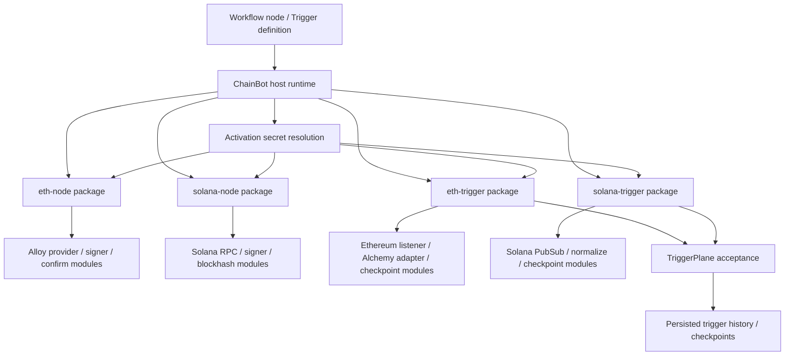
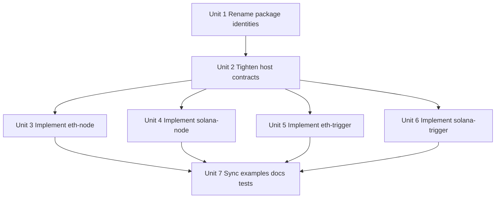

# feat: Implement real Ethereum and Solana SDK-backed plugins

## Overview

新增一个 follow-up 实现计划，把当前仅完成 source/install/catalog/activation/runtime shell 的官方链插件，推进到真实可用的 SDK-backed internal implementation。新计划覆盖四个 package 的真实链逻辑落地、硬切换 package identity、最小必要的 host contract 收口，以及 examples/docs/test 的同步更新。

## Problem Frame

仓库已经具备官方链插件的宿主边界：source install、catalog discoverability、managed secret activation、external trigger runtime、live-only listener shell 都已经存在；但 `official-plugins/*` 内部仍然只是启动框架和占位响应，尚未集成真实链 SDK、真实 RPC、真实签名、真实确认轮询、以及真实链监听。

这次工作不是再次扩 `chainbot runtime`，而是把真实链语义补回到 official plugin package 内部，同时修正当前过长的 package identity，直接切换到更短、更清晰的官方命名：`eth-node`、`eth-trigger`、`solana-node`、`solana-trigger`。

## Requirements Trace

- R1. 官方 package identity 采用硬切换命名：`eth-node`、`eth-trigger`、`solana-node`、`solana-trigger`，不再保留 `*-official-plugin` 兼容层。
- R2. `eth-node` 必须基于当前 Rust Ethereum SDK 实现真实 RPC 读写能力，优先使用 Alloy。
- R3. `solana-node` 必须基于当前官方 Solana Rust SDK 生态实现真实 RPC 读写能力。
- R4. `eth-trigger` 与 `solana-trigger` 必须实现真实链监听，而不是仅输出 `ready` 的空壳进程。
- R5. Ethereum 监听除了 provider-agnostic surface 外，V1 应至少规划一个 Alchemy-specific monitoring surface。
- R6. 写操作继续只允许 managed local signing；host 只负责 execution-time secret resolution 和 activation injection。
- R7. Ethereum 与 Solana 的 confirmation / finality 语义必须保持链特定，不得被一个共享抽象抹平。
- R8. Listener 继续保持 live-only；V1 不引入 historical replay、downtime backfill、或 missed-event recovery。
- R9. 真实链实现不得把 Alloy / Solana SDK / provider 逻辑回填到 `chainbot runtime`。
- R10. 主验证路径必须保持 deterministic repo-local tests；真实公网 provider 验证只能是 opt-in qualification，不得成为默认 correctness gate。

## Scope Boundaries

- 不新增 protocol-specific business workflow，如 swap、LP、staking、claim。
- 不引入 browser wallet、custody-only signing、remote signer delegation、或 provider-side unlocked account 模式。
- 不引入 runtime-owned multichain RPC abstraction 来统一 Ethereum 与 Solana 的链语义。
- 不在 V1 为 listener 加 replay/backfill。
- 不把 Alchemy-specific capability 伪装成通用 Ethereum guarantee。
- 不要求 `chainbot runtime` 解析 plugin-owned checkpoint internals。
- 不把默认测试策略改成依赖真实公网 RPC 的 integration suite。

## Context & Research

### Relevant Code and Patterns

- `docs/archive/2026-03-31-001-feat-eth-solana-official-plugins-plan.md` 已经定义了上一阶段的 host/runtime/source/install 边界，本计划是在该基础上的 follow-up，而不是重写需求。
- `chainbot-plugin-index.toml` 负责 repository-local official source catalog。
- `official-plugins/build-official-plugin/config.toml` 提供 canonical build-to-bin package shape。
- `crates/chainbot/src/plugin/contract.rs` 定义 node/trigger manifest、operation metadata、activation envelope、以及 protocol contract。
- `crates/chainbot/src/plugin/host.rs` 与 `crates/chainbot/src/app/runtime/execution.rs` 是 node execution host 边界。
- `crates/chainbot/src/domain/trigger/contract.rs`、`crates/chainbot/src/app/runtime/external_triggers/process_listener.rs`、`supervisor.rs` 是 trigger runtime / listener host 边界。
- `crates/chainbot/src/plugin/source/{manifest.rs,discover.rs,prepare.rs,install.rs}` 是 source discoverability 与 staged install 的现有实现模式。
- `examples/eth-plugin-integrations/` 与 `examples/solana-plugin-integrations/` 已经存在，可以直接演化成真实官方链 examples。

### Institutional Learnings

- official plugin 的 chain-specific logic 必须留在 package-local code；`chainbot runtime` 只保留 generic control-plane concerns。参考 `docs/decisions/CHAINBOT_OFFICIAL_PLUGIN_DESIGN.md`。
- package identity 是 directory name + package-local `config.toml` 的硬边界；rename 不是 cosmetic change。参考 `docs/decisions/CHAINBOT_PLUGIN_SOURCE_INSTALL_DESIGN.md` 与 `docs/decisions/CHAINBOT_CONFIG_STATE_LAYOUT_DESIGN.md`。
- activation secret 是 root-owned、execution-time-only、fail-closed 的 contract；不得混入 node `input` 或 trigger `params`。参考 `docs/decisions/CHAINBOT_PLUGIN_ACTIVATION_CONFIG_DESIGN.md`。
- trigger 扩展必须继续依赖稳定 top-level fields + `params`，而不是新增一批 root-global chain config。参考 `docs/decisions/CHAINBOT_TRIGGER_WORKFLOW_CONFIG_DESIGN.md`。
- accepted-event truth source 必须继续留在 `TriggerPlane`；plugin-local buffer 不能成为 durable truth。

### External References

- Alloy 当前是 Rust Ethereum SDK 的推荐主线，应优先于 `ethers-rs`。
- Solana 官方 Rust 生态已经明确模块化：`solana-rpc-client`、`solana-pubsub-client`、`solana-sdk`、`solana-signer`、`solana-keypair` 应按职责组合，而不是只依赖一个 umbrella crate。
- Alchemy 官方建议 WebSocket 主要用于 subscription；普通 JSON-RPC 应走 HTTP。
- Solana 官方文档强调：`sendTransaction` 成功只代表 admission，不代表 confirmation；`recent_blockhash` expiry 必须被视为主流程状态。

## Key Technical Decisions

- **Hard-cut package rename**：本计划直接把官方 package identity 切换到 `eth-node`、`eth-trigger`、`solana-node`、`solana-trigger`，不为旧 `*-official-plugin` 名称保留 compatibility layer。理由：用户已明确要求硬切换，且当前仓库不存在 alias / redirect 机制，继续保留双名只会扩大 source/install/catalog/example/activation blast radius。
- **Hard-cut rename 同时包含 deterministic migration/fail-fast contract**：任何 root 只要仍引用旧 official package id、或同时存在新旧官方 package directory，就必须在 `validate`、`catalog`、`status`、`plugin install` 阶段 fail fast；旧 official package directory 不被视为兼容别名，而被视为必须移除的 legacy installation。理由：当前 `plugin_id` 同时绑定 package identity、activation scope、installed directory identity，不能允许 mixed-state root 进入不确定运行状态。
- **保留 four-package topology**：继续保持每链一个 node package、一个 trigger package。理由：node 与 trigger 的 lifecycle、SDK 依赖、测试形态、以及 operator expectations 都不同，强行合并会让 package boundary 变差。
- **Ethereum node 使用 fine-grained Alloy crates，而不是 `alloy/full`**：优先用 `alloy-provider`、`alloy-transport-http`、`alloy-transport-ws`、`alloy-signer`、`alloy-signer-local`、`alloy-rpc-types-eth`。理由：减少无关依赖面，并把 subscription / signer / transport feature 明确化。
- **Solana node/trigger 使用 official modular crates**：优先用 `solana-rpc-client`、`solana-pubsub-client`、`solana-sdk`、`solana-signer`、`solana-keypair`、`solana-commitment-config`。理由：与当前官方模块化方向一致，且更利于按 node / trigger surface 拆分依赖。
- **Write result 只在 host 暴露 generic lifecycle lattice**：host 只理解最小共享状态，如 `pre_submit_failure`、`submitted`、`settled`、`ambiguous`，不解释 Ethereum `safe` / `finalized` 或 Solana `confirmed` / `finalized` 的链语义；链特定 finality/commitment label 继续由 plugin-owned metadata 暴露。理由：既能统一 shared host contract，又不把链词汇抬进 runtime。
- **V1 默认禁止 silent auto-resubmit after a broadcast identity exists**：Ethereum 与 Solana 在已产生 broadcast identity 或进入 post-submit ambiguous 状态后，都不做隐式自动重发；只有 Solana 在“尚未成功广播、仅 blockhash 过期”的 pre-submit 路径下，才允许 package-local rebuild/resign policy。理由：避免重复广播和不可审计的隐式重试。
- **把 trigger ack 明确定义为 durable acceptance barrier**：plugin 只能在收到 ack 后推进自己的 listener cursor，而 ack 只在 host 已 durably persist accepted event 与对应 checkpoint fence 之后发送。理由：真实链 listener 需要一个稳定的 crash-window correctness contract，而不是“frame received”语义。
- **V1 listener 采用 post-threshold emit，不提供 reversal contract**：对于 provider-agnostic source，plugin 只在达到选定的 confirmation / commitment 阈值后才发出事件，不先发 provisional event 再发撤销事件。理由：当前 host/TriggerPlane 并没有 reversal semantics，V1 需要用更保守的 emit policy 换取 correctness。
- **Ethereum trigger 的 Alchemy V1 canonical source 固定为 `alchemy_mined_tx`**：本计划锁定一个 provider-specific Ethereum source，而不是在实现时再在多个 Alchemy source 之间摇摆。理由：`alchemy_mined_tx` 比 pending-mempool 观察更适合进入持久 accepted-event 流程，也便于 examples/docs/test 建立稳定断言。
- **Provider credentials 不得以明文嵌入 curated endpoint URL 或 example params**：凡是 secret-bearing provider credential，如 API key、auth token、signed header secret，都必须通过 activation secret binding 在 runtime 组装或注入；curated examples 只展示无密钥 endpoint base URL 与 secret slot。理由：避免把敏感 provider URL 正常化进 repo config，并与现有 activation design 保持一致。
- **`expired_before_send` 归属于 shared host lattice 的 `pre_submit_failure`**：Solana blockhash 在未形成 broadcast identity 前过期时，host-visible state 仍是 `pre_submit_failure`，而具体原因为 plugin-owned metadata / error code。理由：这样可以保持 shared lattice 极简，同时不给 host 注入 Solana-specific state vocabulary。
- **Solana trigger 按 mental model 暴露 listener，而不是 raw PubSub payload**：state-change 与 event-log 两类 surface 分别映射到 account/program subscription 与 log subscription，plugin 在 package-local normalize 后再输出给 host。理由：原始 PubSub payload 太重、太不稳定，不适合作为长期 contract。
- **Deterministic local qualification first**：Ethereum 优先使用 local EVM node / deterministic transport fixtures；Solana 优先使用 mock RPC + local validator / deterministic PubSub fixtures；真实公网 provider 只作为 opt-in qualification。理由：仓库测试约束明确要求 deterministic，不允许把 correctness 建立在公网依赖上。

## Open Questions

### Resolved During Planning

- 是否更新旧计划还是新建 follow-up plan：新建 follow-up plan。
- 去掉旧后缀时采用什么迁移策略：硬切换命名，不保留兼容期。
- Ethereum node SDK 主线是什么：Alloy。
- Solana node/trigger SDK 主线是什么：官方 modular Rust crates。
- Alchemy 能力如何进入 V1：作为 Ethereum trigger 的 provider-specific surface，而不是通用 Ethereum semantics。
- Alchemy V1 的唯一 canonical enhanced source 是什么：`alchemy_mined_tx`。
- 真实链实现的主测试策略是什么：deterministic local qualification 为主，live provider smoke 为辅。
- 真实链实现是否允许扩 host runtime 承担链逻辑：不允许，除非是 generic host invariant 或 durable acceptance correctness 所必需的极小改动。

### Deferred to Implementation

- 具体 crate version pin 与 feature flag 组合，等实现时根据当时 crates.io / docs.rs 实际版本锁定。
- 各插件 `metadata` 的具体字段集合与 naming，留待实现阶段结合真实 SDK output 决定。
- 若 durable acceptance barrier 需要最小协议扩展，具体 field naming 与 serialization shape 留待实现阶段在现有 host contract 上最小化设计，但 barrier semantics 本身不再开放。

## High-Level Technical Design

> *This illustrates the intended approach and is directional guidance for review, not implementation specification. The implementing agent should treat it as context, not code to reproduce.*

### Runtime and package split

| Surface | Host runtime owns | Plugin package owns |
|---|---|---|
| Node read | request validation, activation injection, output redaction | RPC shaping, decoding, provider errors |
| Node write | generic pre-dispatch guardrails, default confirmation injection | simulation, signing, submission, confirmation, ambiguous result handling |
| Trigger startup | session lifecycle, heartbeat, durable acceptance, persisted checkpoints | subscription setup, event normalization, checkpoint encoding, provider-specific monitoring |

### Write lifecycle guidance

- Ethereum write lifecycle: `prepare -> optional preflight -> local sign -> broadcast -> included/safe/finalized wait`
- Solana write lifecycle: `prepare -> fetch recent blockhash -> optional simulation -> local sign -> send -> confirmed/finalized wait -> rebuild/resign on blockhash expiry when policy allows`
- 两条链都必须显式处理 “broadcast 后状态未知” 的 ambiguous branch。
- 一旦存在可识别 broadcast identity，两条链都不得做 silent auto-resubmit；自动重发只允许发生在明确的 pre-submit / no-broadcast-identity Solana blockhash expiry path。

### Listener lifecycle guidance

- Listener startup 继续是 live-only。
- 断线后继续使用 supervisor restart，但只从新的 live head 继续，不做 backfill。
- plugin-owned checkpoint 继续由 host 透明存储；host 不解析其内部含义。
- 真实 listener 实现前，需要先把 ack 与 durable acceptance 的关系收口，否则真实 cursor advancement 会和 persisted truth 脱节。

### Listener finality policy

- `eth_log` 只在达到选定 confirmation threshold 后 emit；V1 不提供 reversal event contract。
- `eth_new_head` 或任何 head-driven state watcher 只在达到选定 finality threshold 后 emit，不把最新观察到的 head 直接写入 accepted history。
- `alchemy_mined_tx` 作为 Ethereum 的唯一 Alchemy-enhanced canonical source，只在 mined transaction notification 满足计划选定的 emit threshold 后进入 accepted-event path。
- `solana_account`、`solana_logs`、`solana_signature` 只在达到配置的 commitment threshold 后 emit，不发送 rollback correction event。

### Listener acceptance and restart matrix

| Situation | Plugin may advance cursor? | Host must have durably persisted | Allowed outcome after restart |
|---|---|---|---|
| Event observed, not yet acked | No | Nothing new | Event may be re-observed and re-emitted |
| Event acked | Yes | Accepted event record plus checkpoint fence for that accepted event | Duplicate replay must be suppressed by durable dedup state |
| Crash after plugin emit, before durable accept | No | Nothing new | Event may be seen again; no silent loss |
| Crash after durable accept, before plugin-local cursor advance | Not yet | Accepted event record plus checkpoint fence | Re-observation is allowed but must dedup to no new workflow run |

### Shared node result lattice

| Host-visible state | Meaning | Chain-specific detail lives in |
|---|---|---|
| `pre_submit_failure` | request failed before any broadcast identity existed | plugin-owned error or `metadata` |
| `submitted` | a broadcast identity exists and caller requested submit-only | plugin-owned `metadata` |
| `settled` | requested finality/commitment threshold reached | plugin-owned `metadata` |
| `ambiguous` | plugin cannot prove whether post-submit lifecycle settled cleanly | plugin-owned `metadata` |

- Solana `expired_before_send` is represented as `pre_submit_failure` plus plugin-owned reason metadata, not as a new host-visible state.

## Alternative Approaches Considered

- **保留旧 package id，只在 CLI 中显示短名**：未采用。原因：当前 `plugin_id` 直接绑定 source/install target、activation key、package identity validation，显示层重命名无法解决 operator-facing identity 冗余。
- **把 Ethereum / Solana 共享成一个 multichain support crate 与统一 confirmation model**：未采用。原因：两条链在 nonce / blockhash、finality、subscription model 上差异太大，强统一只会把关键语义藏起来。
- **让 host runtime 实现 shared write lifecycle 和 listener reconnect policy**：未采用。原因：违反 thin-runtime 边界，也会把 provider-specific decision 锁死在宿主层。

## Implementation Units

- [x] **Unit 1: Hard-rename official package identities and update all registry surfaces**

**Goal:** 把官方链 package identity 从 `*-official-plugin` 硬切换到短名，并让 source/install/catalog/example/activation surface 一次性收敛到新名称。

**Requirements:** R1, R9

**Dependencies:** None

**Files:**
- Modify: `chainbot-plugin-index.toml`
- Create: `official-plugins/eth-node/`
- Create: `official-plugins/eth-trigger/`
- Create: `official-plugins/solana-node/`
- Create: `official-plugins/solana-trigger/`
- Delete: `official-plugins/eth-node-official-plugin/`
- Delete: `official-plugins/eth-trigger-official-plugin/`
- Delete: `official-plugins/solana-node-official-plugin/`
- Delete: `official-plugins/solana-trigger-official-plugin/`
- Modify: `examples/eth-plugin-integrations/chainbot.toml`
- Modify: `examples/eth-plugin-integrations/workflows/wf-eth-node/config.toml`
- Modify: `examples/eth-plugin-integrations/triggers/eth-live-transfers/config.toml`
- Modify: `examples/solana-plugin-integrations/chainbot.toml`
- Modify: `examples/solana-plugin-integrations/workflows/wf-solana-node/config.toml`
- Modify: `examples/solana-plugin-integrations/triggers/solana-account-watch/config.toml`
- Modify: `crates/chainbot/src/app/cli/help.rs`
- Modify: `crates/chainbot/src/app/cli/commands.rs`
- Modify: `crates/chainbot/src/app/definitions/validate.rs`
- Modify: `crates/chainbot/src/app/cli/view/catalog.rs`
- Modify: `crates/chainbot/src/app/cli/view/plugin_source.rs`
- Modify: `crates/chainbot/src/app/cli/view/status.rs`
- Test: `crates/chainbot/tests/plugin_source_surface.rs`
- Test: `crates/chainbot/tests/plugin_install_surface.rs`
- Test: `crates/chainbot/tests/catalog_surface.rs`
- Test: `crates/chainbot/tests/cli_surface.rs`
- Test: `crates/chainbot/tests/config_loading.rs`

**Approach:**
- Treat rename as canonical identity migration, not as a display-layer alias.
- Update source index, installed package references, `plugin_activation.<plugin_id>` examples, and CLI/read-model strings in one unit so repo never has mixed canonical names.
- Keep old names out of current-state docs and examples after the rename lands; only archived plans may still mention them historically.
- Define a hard-cut migration contract for existing roots: old official package ids in config fail validation; mixed old/new official package directories fail validation; legacy official package directories must be removed before the root is considered healthy.
- Enforce the migration contract in real validation and install entrypoints, not only in read models and example fixtures.

**Patterns to follow:**
- `chainbot-plugin-index.toml`
- `crates/chainbot/src/app/definitions/validate.rs`
- `docs/decisions/CHAINBOT_PLUGIN_SOURCE_INSTALL_DESIGN.md`

**Test scenarios:**
- Happy path: `plugin source list/show` exposes only `eth-node`, `eth-trigger`, `solana-node`, and `solana-trigger` as canonical official packages.
- Happy path: installing only `eth-node` or only `solana-trigger` updates installed `catalog` output with the new package ids and leaves source/install split intact.
- Error path: a root config that still uses old `plugin_activation."eth-node-official-plugin"` fails validation with a deterministic unknown-plugin message.
- Error path: a root that contains both `plugins/eth-node-official-plugin/` and `plugins/eth-node/` fails validation deterministically instead of entering mixed-state runtime behavior.
- Integration: curated examples validate using only the new package ids and new activation keys.

**Verification:**
- Current-state repo surfaces no longer depend on the old `*-official-plugin` identities outside archived history.

- [x] **Unit 2: Tighten host contracts for real chain write/listener semantics**

**Goal:** 在不破坏 thin-runtime 边界的前提下，把真实链实现所必需的 shared contract gaps 收口到最小可行范围。

**Requirements:** R6, R7, R8, R9, R10

**Dependencies:** Unit 1

**Files:**
- Modify: `crates/chainbot/src/plugin/contract.rs`
- Modify: `crates/chainbot/src/domain/trigger/contract.rs`
- Modify: `crates/chainbot/src/app/runtime/execution.rs`
- Modify: `crates/chainbot/src/app/runtime/external_triggers/process_listener.rs`
- Modify: `crates/chainbot/src/app/runtime/daemon.rs`
- Modify: `crates/chainbot/src/secrets.rs`
- Test: `crates/chainbot/tests/chain_node_plugin_host.rs`
- Test: `crates/chainbot/tests/chain_trigger_runtime.rs`
- Test: `crates/chainbot/tests/trigger_plane.rs`
- Test: `crates/chainbot/tests/execution_scheduler.rs`

**Approach:**
- Keep host changes limited to generic protocol/result semantics, activation injection, redaction, and durable acceptance boundaries.
- Explicitly define the shared node result contract so plugins can distinguish `submitted`, chain-specific confirmation success, and post-submit ambiguous failure without inventing incompatible shapes per chain.
- Adjust external trigger host flow so plugin-side cursor advancement cannot run ahead of durable acceptance truth; the plan should treat this as a correctness fix, not as new chain-specific runtime logic.
- Preserve host-opaque checkpoint storage while making the acceptance boundary explicit.
- Add a restart/crash-window matrix to the host contract so checkpoint persistence, durable dedup, and plugin-local cursor advancement cannot drift independently.

**Technical design:** *(directional guidance, not implementation specification)*
- The host may widen stable top-level result fields, but chain-specific receipt/metadata stays plugin-defined under `metadata`.
- Trigger ack must correspond to a post-persist acceptance barrier; a raw “frame received” ack is not sufficient for real chain listeners.

**Patterns to follow:**
- `crates/chainbot/src/plugin/contract.rs`
- `crates/chainbot/src/app/runtime/execution.rs`
- `crates/chainbot/src/app/runtime/external_triggers/process_listener.rs`
- `docs/decisions/CHAINBOT_OFFICIAL_PLUGIN_DESIGN.md`
- `docs/decisions/CHAINBOT_PLUGIN_ACTIVATION_CONFIG_DESIGN.md`

**Test scenarios:**
- Happy path: host still injects activation secrets only at execution time and redacts secret leakage from surfaced text.
- Happy path: caller omits confirmation mode and host injects the default confirmation required by the plugin manifest.
- Error path: a managed-signing node operation returns a deterministic ambiguous result when submission status is unknown after broadcast.
- Integration: crash-window behavior between trigger event receipt and durable acceptance preserves replay safety instead of silently losing the event.
- Integration: trigger checkpoint persistence remains host-opaque while ack semantics still allow listener restart correctness.
- Integration: crash after durable acceptance but before plugin-local cursor advance results in re-observation that dedups to zero new workflow runs.

**Verification:**
- Real chain plugins can rely on one stable host contract for write result states and durable listener acceptance without pulling chain SDK logic into runtime.

- [x] **Unit 3: Implement `eth-node` with Alloy-backed reads, writes, and confirmation policy**

**Goal:** 把 `eth-node` 从 placeholder binary 提升为真实 Alloy-backed Ethereum node plugin。

**Requirements:** R2, R6, R7, R9, R10

**Dependencies:** Unit 2

**Files:**
- Modify: `official-plugins/eth-node/config.toml`
- Modify: `official-plugins/eth-node/crate/Cargo.toml`
- Create: `official-plugins/eth-node/crate/src/lib.rs`
- Create: `official-plugins/eth-node/crate/src/contract.rs`
- Create: `official-plugins/eth-node/crate/src/config.rs`
- Create: `official-plugins/eth-node/crate/src/errors.rs`
- Create: `official-plugins/eth-node/crate/src/provider.rs`
- Create: `official-plugins/eth-node/crate/src/signing.rs`
- Create: `official-plugins/eth-node/crate/src/preflight.rs`
- Create: `official-plugins/eth-node/crate/src/confirm.rs`
- Create: `official-plugins/eth-node/crate/src/operations/read.rs`
- Create: `official-plugins/eth-node/crate/src/operations/write.rs`
- Modify: `official-plugins/eth-node/crate/src/main.rs`
- Test: `official-plugins/eth-node/crate/tests/read_rpc.rs`
- Test: `official-plugins/eth-node/crate/tests/write_lifecycle.rs`
- Test: `official-plugins/eth-node/crate/tests/provider_capabilities.rs`
- Test: `crates/chainbot/tests/chain_node_plugin_host.rs`

**Approach:**
- Replace placeholder JSON branching with real Alloy provider/signing modules.
- Reads go through HTTP RPC and support explicit block tag / endpoint inputs.
- Writes continue to use managed local signing only; plugin consumes `activation.secrets.signer` and broadcasts signed payloads itself.
- Preflight remains optional but first-class; default confirmation remains `safe` unless caller explicitly lowers or raises it.
- Provider capability probing must fail closed when requested confirmation semantics are unsupported.
- Result shaping must distinguish pre-submit failure, successful submit-only, successful confirm-wait, and ambiguous post-submit failure.
- Once a broadcast identity exists, plugin must return `ambiguous` rather than silently retrying or auto-resubmitting.

**Patterns to follow:**
- `official-plugins/build-official-plugin/config.toml`
- `crates/chainbot/src/plugin/contract.rs`
- `docs/decisions/CHAINBOT_OFFICIAL_PLUGIN_DESIGN.md`

**Test scenarios:**
- Happy path: `eth_get_balance` returns decoded native balance against a deterministic local Ethereum RPC fixture.
- Happy path: `eth_get_token_balance` returns ERC20 balance without requiring signing inputs.
- Happy path: `eth_transfer_native` with managed signer succeeds in `submit_only` mode and returns a transaction identifier.
- Happy path: `eth_raw_write` with omitted confirmation mode uses the host-injected default and waits for `safe` only when the provider supports it.
- Edge case: provider supports `included` but not `safe`; plugin fails closed with a deterministic unsupported-confirmation error rather than downgrading.
- Error path: transport failure after broadcast produces an explicit ambiguous post-submit result, not a generic “failed before send” state.
- Integration: activation signer material is consumed only inside the plugin-local signing path and never leaks through host-visible error output.

**Verification:**
- `eth-node` performs real Alloy-backed reads/writes and enforces Ethereum-specific confirmation policy inside the package.

- [x] **Unit 4: Implement `solana-node` with official RPC, signing, simulation, and blockhash lifecycle handling**

**Goal:** 把 `solana-node` 从 placeholder binary 提升为真实 Solana node plugin。

**Requirements:** R3, R6, R7, R9, R10

**Dependencies:** Unit 2

**Files:**
- Modify: `official-plugins/solana-node/config.toml`
- Modify: `official-plugins/solana-node/crate/Cargo.toml`
- Create: `official-plugins/solana-node/crate/src/lib.rs`
- Create: `official-plugins/solana-node/crate/src/contract.rs`
- Create: `official-plugins/solana-node/crate/src/config.rs`
- Create: `official-plugins/solana-node/crate/src/errors.rs`
- Create: `official-plugins/solana-node/crate/src/rpc.rs`
- Create: `official-plugins/solana-node/crate/src/signing.rs`
- Create: `official-plugins/solana-node/crate/src/simulate.rs`
- Create: `official-plugins/solana-node/crate/src/blockhash.rs`
- Create: `official-plugins/solana-node/crate/src/confirm.rs`
- Create: `official-plugins/solana-node/crate/src/operations/read.rs`
- Create: `official-plugins/solana-node/crate/src/operations/write.rs`
- Modify: `official-plugins/solana-node/crate/src/main.rs`
- Test: `official-plugins/solana-node/crate/tests/read_rpc.rs`
- Test: `official-plugins/solana-node/crate/tests/write_lifecycle.rs`
- Test: `official-plugins/solana-node/crate/tests/blockhash_expiry.rs`
- Test: `crates/chainbot/tests/chain_node_plugin_host.rs`

**Approach:**
- Use official nonblocking Solana RPC client modules for reads/writes and keep commitment explicit.
- Simulation remains optional but explicit; `sendTransaction` admission must not be treated as final success.
- `recent_blockhash` and `lastValidBlockHeight` must be modeled as first-class write lifecycle state, not as retry footnotes.
- Signing stays local and activation-secret-backed, with no remote signer or provider wallet bypass.
- Result shaping must distinguish admitted submit-only, confirmed/finalized success, expired-before-send, and ambiguous-after-submit states.
- Automatic rebuild/resign is only allowed when blockhash expiry occurs before any broadcast identity exists; after that boundary the plugin must surface `ambiguous` or deterministic failure instead of hidden retries.

**Patterns to follow:**
- `crates/chainbot/src/plugin/contract.rs`
- `docs/decisions/CHAINBOT_OFFICIAL_PLUGIN_DESIGN.md`
- `docs/decisions/CHAINBOT_PLUGIN_ACTIVATION_CONFIG_DESIGN.md`

**Test scenarios:**
- Happy path: `solana_get_balance` returns decoded native balance using deterministic RPC fixtures.
- Happy path: `solana_get_token_balance` returns SPL token balance without signer activation.
- Happy path: `solana_transfer_native` succeeds at `confirmed` commitment and returns a transaction signature.
- Edge case: caller requests `finalized` and plugin waits for the correct Solana commitment instead of treating RPC admission as success.
- Error path: blockhash expires before successful submission and plugin returns a deterministic expired-blockhash result.
- Edge case: blockhash expiry before broadcast may take the configured rebuild/resign path without generating a duplicate transaction identity.
- Error path: simulation failure surfaces as pre-submit failure and does not create a transaction identifier.
- Error path: post-submit uncertainty does not silently downgrade into hidden retry success.
- Integration: activation signer slot is required only for write-like operations and secret material remains redacted in surfaced failures.

**Verification:**
- `solana-node` performs real Solana RPC operations and handles blockhash/commitment semantics inside package-local code.

- [x] **Unit 5: Implement `eth-trigger` with live-only subscriptions and Alchemy-enhanced monitoring**

**Goal:** 让 `eth-trigger` 具备真实 Ethereum listener 能力，并提供至少一个 Alchemy-specific enhanced monitoring surface。

**Requirements:** R4, R5, R6, R7, R8, R9, R10

**Dependencies:** Unit 2

**Files:**
- Modify: `official-plugins/eth-trigger/config.toml`
- Modify: `official-plugins/eth-trigger/crate/Cargo.toml`
- Create: `official-plugins/eth-trigger/crate/src/lib.rs`
- Create: `official-plugins/eth-trigger/crate/src/contract.rs`
- Create: `official-plugins/eth-trigger/crate/src/config.rs`
- Create: `official-plugins/eth-trigger/crate/src/errors.rs`
- Create: `official-plugins/eth-trigger/crate/src/provider.rs`
- Create: `official-plugins/eth-trigger/crate/src/checkpoint.rs`
- Create: `official-plugins/eth-trigger/crate/src/normalize.rs`
- Create: `official-plugins/eth-trigger/crate/src/listeners/logs.rs`
- Create: `official-plugins/eth-trigger/crate/src/listeners/heads.rs`
- Create: `official-plugins/eth-trigger/crate/src/listeners/alchemy_mined.rs`
- Modify: `official-plugins/eth-trigger/crate/src/main.rs`
- Test: `official-plugins/eth-trigger/crate/tests/log_listener.rs`
- Test: `official-plugins/eth-trigger/crate/tests/alchemy_listener.rs`
- Test: `official-plugins/eth-trigger/crate/tests/checkpoint_semantics.rs`
- Test: `crates/chainbot/tests/chain_trigger_runtime.rs`
- Test: `crates/chainbot/tests/trigger_plane.rs`

**Approach:**
- Core provider-agnostic sources remain separate from provider-specific sources; V1 should at least cover `eth_log`, a head-driven Ethereum state watcher, and the canonical Alchemy-specific source `alchemy_mined_tx`.
- Use WebSocket subscription lifecycle for live events; use HTTP only for optional enrichment or capability checks.
- Plugin emits stable `event_id` / `dedup_key` / opaque checkpoint values rather than raw provider payloads.
- Reorg-sensitive events must be normalized explicitly; V1 emits only post-threshold events and does not introduce reversal semantics into host acceptance.
- Restart behavior remains live-only after startup; no replay/backfill is introduced.

**Patterns to follow:**
- `crates/chainbot/src/app/runtime/external_triggers/process_listener.rs`
- `docs/decisions/CHAINBOT_OFFICIAL_PLUGIN_DESIGN.md`
- `docs/engineering/CHAINBOT_INGRESS_TRIGGER_IMPLEMENTATION.md`

**Test scenarios:**
- Happy path: `eth_log` listener starts from current live head and emits only newly observed events after the configured confirmation threshold is met.
- Happy path: `alchemy_mined_tx` listener starts successfully when endpoint/auth inputs support the requested Alchemy capability.
- Edge case: disconnect and restart resume live-only delivery without historical replay and without duplicate run emission for repeated provider bursts.
- Edge case: provider sends duplicate event notifications for the same log identity and emitted `dedup_key` suppresses re-emission in `TriggerPlane`.
- Edge case: provider reports reorg-sensitive log/head movement before the configured threshold and plugin suppresses provisional emission instead of requiring reversal semantics.
- Error path: requested `alchemy_mined_tx` against a non-Alchemy-compatible endpoint fails deterministically rather than silently downgrading to generic logs.
- Integration: trigger checkpoint stays host-opaque while the plugin still restarts from a consistent live-only cursor policy.

**Verification:**
- `eth-trigger` emits real Ethereum live events and keeps Alchemy-specific monitoring isolated behind explicit provider-specific sources.

- [x] **Unit 6: Implement `solana-trigger` with official PubSub listeners and explicit commitment semantics**

**Goal:** 让 `solana-trigger` 具备真实 Solana listener 能力，并把 state-change / event-log mental model 映射为稳定 plugin output。

**Requirements:** R4, R6, R7, R8, R9, R10

**Dependencies:** Unit 2

**Files:**
- Modify: `official-plugins/solana-trigger/config.toml`
- Modify: `official-plugins/solana-trigger/crate/Cargo.toml`
- Create: `official-plugins/solana-trigger/crate/src/lib.rs`
- Create: `official-plugins/solana-trigger/crate/src/contract.rs`
- Create: `official-plugins/solana-trigger/crate/src/config.rs`
- Create: `official-plugins/solana-trigger/crate/src/errors.rs`
- Create: `official-plugins/solana-trigger/crate/src/pubsub.rs`
- Create: `official-plugins/solana-trigger/crate/src/checkpoint.rs`
- Create: `official-plugins/solana-trigger/crate/src/normalize.rs`
- Create: `official-plugins/solana-trigger/crate/src/listeners/logs.rs`
- Create: `official-plugins/solana-trigger/crate/src/listeners/account.rs`
- Create: `official-plugins/solana-trigger/crate/src/listeners/signature.rs`
- Modify: `official-plugins/solana-trigger/crate/src/main.rs`
- Test: `official-plugins/solana-trigger/crate/tests/log_listener.rs`
- Test: `official-plugins/solana-trigger/crate/tests/account_listener.rs`
- Test: `official-plugins/solana-trigger/crate/tests/signature_listener.rs`
- Test: `official-plugins/solana-trigger/crate/tests/checkpoint_semantics.rs`
- Test: `crates/chainbot/tests/chain_trigger_runtime.rs`
- Test: `crates/chainbot/tests/trigger_plane.rs`

**Approach:**
- Use official nonblocking PubSub client and design internal task ownership around the documented async stream constraints.
- Keep state-change and event-log listener surfaces distinct even if some underlying Solana APIs overlap.
- Normalize heavy/raw notification payloads into stable plugin payloads before they cross into host acceptance.
- Treat commitment as explicit listener policy; do not default to the earliest observable state when the trigger contract expects stronger semantics, and do not emit pre-commitment provisional events that would require rollback correction later.
- Keep restart behavior live-only and plugin-owned checkpoint values opaque to host.

**Patterns to follow:**
- `crates/chainbot/src/domain/trigger/contract.rs`
- `crates/chainbot/src/app/runtime/external_triggers/process_listener.rs`
- `docs/decisions/CHAINBOT_TRIGGER_WORKFLOW_CONFIG_DESIGN.md`

**Test scenarios:**
- Happy path: state-change listener based on account/program updates emits normalized payloads and stable event identity only after the configured commitment level is met.
- Happy path: log listener emits live transaction-log events at the configured commitment level.
- Edge case: `signatureSubscribe`-style one-shot listener completes without leaving a stale long-lived session behind.
- Edge case: duplicate notifications for the same slot/event identity generate stable dedup keys and do not cause duplicate workflow runs.
- Edge case: lower-commitment observation that later fails to reach the configured commitment threshold is suppressed before acceptance rather than requiring rollback correction.
- Error path: unsupported or unstable subscription mode is rejected deterministically when selected by trigger params.
- Integration: reconnect after endpoint loss restarts live-only delivery and does not attempt backfill or replay.

**Verification:**
- `solana-trigger` exposes real Solana listener behavior while keeping payload normalization and checkpoint ownership inside the package.

- [x] **Unit 7: Sync canonical examples, docs, and test fixtures with real SDK-backed official plugins**

**Goal:** 让 examples/docs/tests 反映新的 package ids、真实 capability surface、以及 provider/commitment-specific operator expectations。

**Requirements:** R1, R4, R5, R8, R10

**Dependencies:** Unit 3, Unit 4, Unit 5, Unit 6

**Files:**
- Modify: `examples/eth-plugin-integrations/chainbot.toml`
- Modify: `examples/eth-plugin-integrations/workflows/wf-eth-node/config.toml`
- Modify: `examples/eth-plugin-integrations/triggers/eth-live-transfers/config.toml`
- Modify: `examples/eth-plugin-integrations/README.md`
- Modify: `examples/solana-plugin-integrations/chainbot.toml`
- Modify: `examples/solana-plugin-integrations/workflows/wf-solana-node/config.toml`
- Modify: `examples/solana-plugin-integrations/triggers/solana-account-watch/config.toml`
- Modify: `examples/solana-plugin-integrations/README.md`
- Modify: `examples/README.md`
- Modify: `docs/decisions/CHAINBOT_OFFICIAL_PLUGIN_DESIGN.md`
- Modify: `docs/decisions/CHAINBOT_PLUGIN_ACTIVATION_CONFIG_DESIGN.md`
- Modify: `docs/decisions/CHAINBOT_PLUGIN_SOURCE_INSTALL_DESIGN.md`
- Create: `docs/engineering/CHAIN_PLUGIN_PROVIDER_QUALIFICATION_IMPLEMENTATION.md`
- Create: `official-plugins/eth-node/crate/tests/live_qualification.rs`
- Create: `official-plugins/eth-trigger/crate/tests/live_qualification.rs`
- Create: `official-plugins/solana-node/crate/tests/live_qualification.rs`
- Create: `official-plugins/solana-trigger/crate/tests/live_qualification.rs`
- Test: `crates/chainbot/tests/cli_surface.rs`
- Test: `crates/chainbot/tests/catalog_surface.rs`
- Test: `crates/chainbot/tests/plugin_source_surface.rs`
- Test: `crates/chainbot/tests/plugin_install_surface.rs`

**Approach:**
- Update examples so they demonstrate the real package ids, stable activation slot names, and realistic operation/trigger sources.
- Document Ethereum Alchemy-specific listener surfaces as optional provider-specific capability, not as generic Ethereum baseline.
- Document Solana commitment and blockhash lifecycle expectations where operators need to choose semantics deliberately.
- Add an explicit opt-in provider qualification harness and operator doc so live-provider verification is a concrete artifact, not just a stated intention.
- Make live qualification non-default by contract: package-local `live_qualification.rs` targets are gated behind a dedicated cargo feature and ignored/manual test classification so plain `cargo test` remains deterministic.
- Keep curated examples free of secret-bearing provider URLs; examples use activation slots rather than embedded credentials.
- Keep docs concise and stable: design docs record settled boundaries, while this plan remains the execution artifact for sequencing and rollout.

**Patterns to follow:**
- `examples/plugin-integrations/`
- `docs/decisions/CHAINBOT_OFFICIAL_PLUGIN_DESIGN.md`
- `docs/decisions/CHAINBOT_PLUGIN_ACTIVATION_CONFIG_DESIGN.md`

**Test scenarios:**
- Happy path: both curated chain example roots validate with the new package ids and current activation config shape.
- Happy path: `catalog show` and `plugin source show` describe the final real capability surfaces consistently.
- Edge case: examples remain unambiguous when only one chain’s packages are installed into a root.
- Integration: CLI help, examples, and source/catalog naming all use the same canonical short package ids.
- Integration: opt-in live qualification artifacts exist per package and are documented as non-default operator verification, not as correctness-gating tests.
- Error path: running the default deterministic test suite without the dedicated live qualification feature never attempts real provider calls.

**Verification:**
- The repo’s current examples and docs describe the same real plugin surfaces that the packages and CLI now expose.
- Default repository correctness gates remain deterministic, while live-provider qualification stays opt-in and explicitly documented.

## Implementation Unit Dependencies

## System-Wide Impact

- **Interaction graph:** `plugin/source/*`, `plugin/contract.rs`, `plugin/host.rs`, `app/runtime/execution.rs`, `app/runtime/external_triggers/*`, `domain/trigger/*`, official plugin crates, curated examples, and CLI read models all participate in the delivered surface.
- **Error propagation:** provider/auth/transport errors originate in package-local SDK code, then pass through stable host contract mapping and secret redaction before surfacing to users.
- **State lifecycle risks:** Ethereum nonce lifecycle, Solana blockhash expiry, trigger ack vs durable acceptance, plugin-owned checkpoints, and duplicate provider deliveries are the primary correctness-bearing state transitions.
- **API surface parity:** source discoverability, installed catalog output, runtime execution, activation config keys, workflow plugin refs, trigger plugin refs, and docs/examples must all move to the new short package ids together.
- **Integration coverage:** package-local unit/integration tests must be paired with host-side contract tests so SDK-backed plugin internals and existing runtime seams stay aligned.
- **Unchanged invariants:** source/install remains staged and rollback-aware; activation secrets stay root-owned and execution-time only; listener delivery remains live-only in V1; host runtime still does not own chain-specific signing, confirmation, or provider policy.
- **Operator root migration contract:** roots that still reference old official package ids or contain mixed old/new official package directories fail fast until operators finish the rename and remove legacy installations.

## Dependencies / Prerequisites

- Deterministic local Ethereum qualification environment, such as a local EVM node or stable RPC fixture strategy, must be available before Unit 3 is considered complete.
- Deterministic local Solana qualification environment, such as mock RPC plus local validator / stable PubSub fixture strategy, must be available before Units 4 and 6 are considered complete.
- Official plugin crate version pinning must be validated against the then-current docs.rs / crates.io state during implementation.

## Risks & Dependencies

| Risk | Mitigation |
|------|------------|
| Hard rename breaks existing examples and operator config | Land rename as its own first unit and update source/catalog/example/activation surfaces atomically |
| Host/runtime scope drifts into chain logic | Keep all SDK, provider, signing, confirmation, and listener semantics inside package-local crates; restrict host changes to shared invariants only |
| Ethereum provider cannot satisfy requested finality semantics | Probe capability package-locally and fail closed when unsupported |
| Solana blockhash expiry causes duplicate or misleading write outcomes | Treat blockhash validity as a first-class write lifecycle state and define explicit ambiguous/expired result handling |
| Trigger ack semantics lose events under crash timing | Tighten ack-to-durable-acceptance boundary before real listeners rely on cursor advancement |
| Alchemy-specific features leak into generic Ethereum contract | Keep provider-specific sources separate from provider-agnostic `eth_*` sources |
| Real network tests become flaky correctness gates | Make deterministic local tests primary and keep live provider checks opt-in only |

## Risk Analysis & Mitigation

| Risk | Likelihood | Impact | Mitigation |
|------|-----------|--------|------------|
| Trigger durability bug due to ack/cursor mismatch | Med | High | Resolve host contract boundary in Unit 2 before listener internals land |
| Provider-specific capability drift across networks | High | Med | Encode provider capability probing and deterministic fail-closed behavior package-locally |
| Rename blast radius leaves stale canonical ids in docs/examples/tests | High | Med | Land rename first, then make all downstream units depend on the renamed identities |
| Chain SDK version churn mid-implementation | Med | Med | Defer exact version pins to implementation while locking crate family choices in the plan |

## Documentation Plan

- Update current-state design docs only where stable boundaries truly change: package identity, activation examples, and official plugin implementation preferences.
- Keep rollout/migration sequencing inside this plan rather than inflating design docs with implementation detail.
- Ensure examples show both node operations and trigger listener setup for each chain using the new short ids.

## Operational / Rollout Notes

- Treat Alchemy-enhanced Ethereum listener surfaces as optional provider-specific capabilities; operators must still be able to run provider-agnostic Ethereum listener surfaces without Alchemy.
- Document clearly that live-only listeners do not recover downtime gaps.
- Document clearly that Solana admission is not confirmation, and that Ethereum `safe` / `finalized` semantics may vary by provider capability.

## Sources & References

- Prior plan: `docs/archive/2026-03-31-001-feat-eth-solana-official-plugins-plan.md`
- Related code: `crates/chainbot/src/plugin/contract.rs`
- Related code: `crates/chainbot/src/plugin/host.rs`
- Related code: `crates/chainbot/src/app/runtime/execution.rs`
- Related code: `crates/chainbot/src/app/runtime/external_triggers/process_listener.rs`
- Related code: `crates/chainbot/src/domain/trigger/contract.rs`
- Related code: `crates/chainbot/src/plugin/source/*`
- Related docs: `docs/decisions/CHAINBOT_OFFICIAL_PLUGIN_DESIGN.md`
- Related docs: `docs/decisions/CHAINBOT_PLUGIN_ACTIVATION_CONFIG_DESIGN.md`
- Related docs: `docs/decisions/CHAINBOT_PLUGIN_SOURCE_INSTALL_DESIGN.md`
- Related docs: `docs/decisions/CHAINBOT_TRIGGER_WORKFLOW_CONFIG_DESIGN.md`
- External docs: Alloy provider / signer / transaction lifecycle documentation
- External docs: Solana RPC, PubSub, and modular Rust SDK documentation
- External docs: Alchemy subscription and WebSocket best-practice documentation
