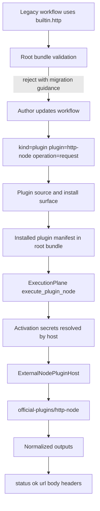

# refactor: Migrate builtin HTTP node to official plugin

## Overview

把当前内嵌在 `chainbot runtime` 里的 outbound HTTP capability 从 `builtin.http` 迁移到 repo-local official external node plugin，统一走现有 `external_node` package、source install、plugin host、activation secret、catalog discoverability 流程。

这次变更的目标不是“换一种实现 HTTP 的方式”，而是把 HTTP 明确收回到 plugin boundary 内，让 `chainbot` 继续只承担 thin control-plane 责任：workflow scheduling、trigger built-ins、plugin discovery/install、generic plugin host lifecycle、secret resolution/injection、和 catalog read model。

## Problem Frame

当前仓库的稳定设计已经明确要求 official capability 留在 package-local plugin 中，runtime 只保留 generic orchestration；但 `crates/chainbot/src/builtins/nodes/handlers/http.rs` 仍然把 HTTP request capability 做成了 builtin node。这让 builtin surface 超出了“workflow primitives + data shaping + trigger built-ins”的边界，也让 discoverability、installation、activation secret ownership、和 official package 演进路径出现了双轨语义。

这次计划要把 HTTP 能力做成 canonical official plugin，并对旧 `builtin.http` authoring 做 hard cut。结果应该是：

- workflow author 不再把 HTTP 当成 builtin，而是写 `kind = "plugin"`
- operator 通过 `plugin source` / install flow 获得 HTTP capability
- builtin catalog 不再暴露 `builtin.http`
- runtime 不新增任何 HTTP-specific branch

## Requirements Trace

- R1. 退役 `builtin.http`，不再把 outbound HTTP 暴露为 builtin node surface。
- R2. 引入 canonical official external node plugin，采用 repo-local `official-plugins/` package 形态，并能通过 `chainbot-plugin-index.toml` 被发现和安装。
- R3. 保持 `ExecutionPlane`、`ExternalNodePluginHost`、`plugin source/install` 的 generic control-plane 边界，不把 HTTP-specific semantics 回填到 runtime。
- R4. 为旧 `plugin = "builtin.http"` workflow authoring 提供 fail-fast 诊断和明确迁移指引，而不是让错误在执行期随机出现。
- R5. 保持 operator-owned secret boundary：HTTP auth secrets 继续走 `plugin_activation` execution-time injection，并通过 machine-checkable activation contract 约束允许的 secret slots 与 destination binding。
- R6. 新 official HTTP plugin 在受支持的 text-oriented response path 上保持与旧 builtin 兼容的输出字段：`status`、`ok`、`url`、`body`、`headers`。
- R7. 更新 examples、catalog、source/install surfaces、和测试，确保 canonical path 完整闭环。

## Scope Boundaries

- 不保留 `builtin.http` compatibility alias，也不做 runtime 内部“builtin 转 plugin”的隐式跳转。
- 不为 HTTP plugin 引入 `mcp.tool.v1`；V1 采用 `node.exec.v1`，贴合当前同步 request-response 能力。
- 不在 runtime 中新增 HTTP retry/backoff、auth scheme、header merge、response decoding 等 protocol semantics。
- 不把 HTTP plugin 扩展成通用 webhook ingress、builtin trigger、或新的 runtime service class。
- 不把 deterministic correctness gate 建立在公网 HTTP endpoint 上；测试以 repo-local mock server 或 deterministic fixture 为主。
- 不要求在本次迁移里同时设计多个复杂 operation families；V1 只锁定最小 canonical surface。
- 不提供 automatic workflow rewrite、automatic plugin install、或 config migration tooling；本次只提供 fail-fast diagnostics 和 canonical manual migration path。

## Context & Research

### Relevant Code and Patterns

- `crates/chainbot/src/app/runtime/execution.rs` 已经把 `kind = "plugin"` 和 builtin registry 分开，HTTP 迁移不需要重写 scheduler，只需要让 HTTP 走现有 plugin path。
- `crates/chainbot/src/plugin/contract.rs` 与 `crates/chainbot/src/plugin/host.rs` 已经定义并实现 `external_node` contract、operation schema enforcement、activation secret envelope、和 host-side redaction。
- `crates/chainbot/src/builtins/nodes/spec.rs`、`registry.rs`、`catalog.rs`、`handlers/http.rs` 是 `builtin.http` 当前完整 blast radius。
- `official-plugins/eth-node/config.toml`、`official-plugins/solana-node/config.toml`、`official-plugins/build-official-plugin/config.toml` 提供了 official Rust plugin package 的 canonical shape。
- `examples/plugin-integrations/workflows/wf-plugin/config.toml`、`examples/eth-plugin-integrations/workflows/wf-eth-node/config.toml` 展示了 `kind = "plugin"` 的 workflow authoring 约定。
- `crates/chainbot/src/app/definitions/validate.rs` 已经承担 cross-package fail-fast validation，并已有对 legacy official plugin id 的 hard-cut precedent。

### Institutional Learnings

- `docs/design/CHAINBOT_OFFICIAL_PLUGIN_DESIGN.md` 已经把 official plugin / thin runtime 边界定死：HTTP semantics 默认应 plugin-owned，而不是 runtime-owned。
- `docs/design/CHAINBOT_PLUGIN_ACTIVATION_CONFIG_DESIGN.md` 明确了 operator-owned secret 应走 `plugin_activation.<plugin_id>.secret_bindings`，并在 execution time 注入 `activation.secrets`。
- `docs/design/CHAINBOT_CONFIG_STATE_LAYOUT_DESIGN.md` 与 `docs/implementation/CHAINBOT_CONFIG_STATE_LAYOUT_IMPLEMENTATION.md` 表明 package identity 是 directory name + `plugin_id` 的硬边界，不能把这次迁移当成纯代码搬运。
- `docs/research/CHAINBOT_CLI_CATALOG_DISCOVERY_PROPOSAL.md` 和 `docs/design/CHAINBOT_CLI_DESIGN.md` 表明 discoverability 必须走 stable read model；HTTP 迁移后，catalog/source/install surface 需要同步闭环。
- `docs/implementation/CHAINBOT_CORE_BUILTIN_NODES_IMPLEMENTATION.md` 的 builtin philosophy 已倾向把 heavier integration surface 留在 plugin side，这次迁移与该方向一致。

### External References

- 本次 planning 明确跳过外部 research。原因是仓库内部对 plugin boundary、package layout、activation、catalog、和 official plugin shape 已有足够强的现成模式；额外外部资料不会改变本次架构选择。

## Key Technical Decisions

- `http-node` 作为 canonical `plugin_id`：沿用 `eth-node` / `solana-node` 的官方 node package 命名方式，让 HTTP capability 一眼看出它属于 official external node plugin，而不是 builtin alias。
- 为 `http-node` 增加最小 generic activation contract：在 `PluginManifest` 上声明 required secret slots 与 destination binding shape，让 root validation 能拒绝未知 slot、缺失 required slot、以及不完整的 activation 配置；这属于 host-enforced safety，而不是 HTTP business logic 回填。
- V1 plugin entrypoint 固定为 `node.exec.v1`：HTTP request 是同步 request-response node，现有 subprocess contract 足够，避免把 transport 复杂度引入 `mcp.tool.v1`。
- V1 operation surface 固定为单一 `request` operation：先建立最小且稳定的 authoring/capability contract，后续若要增加 `json_request` 或更细分 surface，再作为 plugin-internal evolution 处理。
- V1 response contract 锁定字段名与语义，而不是只锁字段名：`body` 只接受 text-oriented response，按固定 text decode policy 输出；`headers` 是 flat string map，剔除 `set-cookie`、`authorization`、`proxy-authorization` 等敏感 response headers；大响应体与不受支持的 binary response 明确失败，而不是自由编码。
- URL 从 builtin 的 `node.operation` 语义迁移为 plugin input 字段：plugin operation 固定为 `request`，实际请求目标由 `input.url` 提供，让 plugin manifest 的 operation metadata 稳定可发现，也避免把每个 URL 误当作 operation identity。
- Secret-bearing auth material 默认属于 `plugin_activation`，而不是 workflow input：`http-node` 的 workflow inputs 不允许携带 `secret://` 引用，workflow `headers` 只承载 non-secret request shaping，任何 operator-owned credential 都应经 `activation.secrets` 注入。
- 若 workflow input 试图与 activation-owned auth header 冲突，plugin fail closed：不允许 authoring side 静默覆盖 operator-managed credential，防止 secret boundary 被绕开。
- V1 outbound destination policy 是 plan-level safety contract，而不是实现细节：仅允许 `http`/`https`，默认拒绝 loopback、RFC1918/private、link-local、unspecified、multicast、和常见 metadata endpoint；若使用 DNS，解析后的目标地址也必须通过同样校验。
- activation-derived auth material 只能发送到 activation contract 声明的 allowed origin set：匿名请求可访问通过 destination policy 的 public endpoint，但任何 activation-owned header 都必须先经过 destination binding 校验。
- V1 timeout 与 redirect policy 在计划阶段锁定：default timeout 固定为 `30s`，禁止无限等待；redirect 默认禁用，不在 V1 暴露 follow-redirect 开关。
- `builtin.http` 在 root bundle validation 阶段 fail fast：不等待到 execution-time 才出现 `UnknownBuiltinNodeKind`，而是在 `validate_bundle_contracts` 中给出明确迁移错误，继续沿用现有仓库对 legacy official plugin id 的 hard-cut 风格。
- runtime 不新增 HTTP-specific fallback branch：`ExecutionPlane::execute_node` 继续只按 `kind = "builtin" | "plugin" | "subflow"` 分流，HTTP migration 只改变 package identity 和 execution surface，不改变 scheduler core。

## Open Questions

### Resolved During Planning

- 新 official plugin 的 canonical identity 是什么：使用 `http-node`，与现有 official node package 命名保持一致。
- 需要怎样避免 activation secret 被发往任意目标：通过 manifest-backed activation contract 声明 allowed origins，并在 plugin 发送前做 destination binding 校验。
- HTTP plugin 应该走哪种 host contract：采用 `node.exec.v1`，不引入 `mcp.tool.v1`。
- 旧 `builtin.http` 应在何处被拦截：在 `crates/chainbot/src/app/definitions/validate.rs` 中作为 legacy authoring fail-fast 拒绝，同时覆盖 `node.kind == "builtin.http"` 与 `node.plugin_id == "builtin.http"` 两条 legacy path，而不是留到 runtime dispatch 时才报错。
- 新 plugin 的最小稳定 operation 是什么：采用单一 `request` operation，避免首版同时开放多条 operation line。
- 新 plugin 的 response shape 是否兼容旧 builtin：在 text-oriented response path 上兼容，首版保持 `status`、`ok`、`url`、`body`、`headers`，但把敏感 response header 与超大/不受支持 body 排除在兼容面之外。
- activation secrets 与 workflow headers 冲突时怎么处理：plugin fail closed，避免 workflow side 静默覆盖 operator-owned auth material。
- `timeout` 与 `redirect policy` 是否留到实现再定：不留；V1 固定 `30s` timeout 且 redirect disabled。

### Deferred to Implementation

- `http-node` crate 内部的 helper/module 精确命名与拆分粒度，留到实现时根据实际编码密度决定。
- 是否为 response 增加兼容外的新 metadata 字段，留到实现时在不破坏旧 schema 的前提下决定。
- 是否把 destination binding 未来提升为对更多 official plugins 通用的 activation contract，留到 `http-node` 落地后再判断是否抽象成 broader plugin-wide pattern。

## High-Level Technical Design

> *This illustrates the intended approach and is directional guidance for review, not implementation specification. The implementing agent should treat it as context, not code to reproduce.*

迁移后的系统形状应满足三件事：

- 旧 builtin authoring 只能 fail early，不能 silently succeed。
- official HTTP capability 必须通过 package identity、source/install、和 catalog surface 被发现，而不是躲在 runtime 内部。
- host 只做 generic enforcement，plugin 自己负责 request semantics、auth assembly、和 response normalization。

## Alternative Approaches Considered

- 保留 `builtin.http`，同时新增 official plugin：拒绝。这样会让 HTTP 继续处于双轨 surface，违背 thin runtime 方向，也让 catalog 和 examples 长期处于模糊状态。
- 在 runtime 内部把 `builtin.http` 隐式转发到 plugin：拒绝。这会把 package/install/activation 细节埋进 runtime 分支里，用户也无法从 authoring surface 看出真实依赖。
- 直接让 official HTTP plugin 走 `mcp.tool.v1`：拒绝。它增加 transport、session、tool discovery 的复杂度，但对同步 HTTP request node 没有清晰收益。

## Implementation Units

- [x] **Unit 1: Define the official HTTP plugin contract and package shape**

**Goal:** 确定 canonical `http-node` package identity、operation surface、activation boundary、和兼容输出 contract，为后续实现、catalog、和迁移 guardrail 提供稳定锚点。

**Requirements:** R2, R4, R5, R6

**Dependencies:** None

**Files:**
- Create: `official-plugins/http-node/config.toml`
- Create: `official-plugins/http-node/crate/Cargo.toml`
- Modify: `crates/chainbot/src/plugin/contract.rs`
- Modify: `crates/chainbot/src/plugin/mod.rs`
- Create: `official-plugins/http-node/crate/src/main.rs`
- Create: `official-plugins/http-node/crate/src/lib.rs`
- Create: `official-plugins/http-node/crate/src/contract.rs`
- Create: `official-plugins/http-node/crate/src/operations/mod.rs`
- Create: `official-plugins/http-node/crate/src/operations/request.rs`
- Test: `crates/chainbot/tests/node_plugin_host.rs`
- Test: `official-plugins/http-node/crate/tests/request_contract.rs`
- Test: `official-plugins/http-node/crate/tests/activation_auth.rs`

**Approach:**
- 把 `http-node` 定义为 `kind = "external_node"` 的 official package，沿用现有 `official-plugins/eth-node` 的 build-to-bin package shape。
- 在 manifest 中只声明一个 `request` operation，并明确 `input_schema` 至少包含 `url`、`method`、`headers`、`body`；输出 schema 保持 `status`、`ok`、`url`、`body`、`headers`。
- 为 `http-node` 增加 machine-checkable activation contract，至少声明 required secret slots、allowed origin binding、和 auth-owned header names，使 operator 配置与 workflow authoring 一开始就边界清晰。

**Patterns to follow:**
- `official-plugins/eth-node/config.toml`
- `official-plugins/build-official-plugin/config.toml`
- `official-plugins/eth-node/crate/src/contract.rs`

**Test scenarios:**
- Happy path: `request` operation manifest validates as a proper `external_node` plugin and exposes the expected input/output schema.
- Happy path: package directory name, `plugin_id`, `entry_artifact`, and build output path stay aligned.
- Edge case: manifest rejects duplicate operation names or missing required fields.
- Error path: plugin manifest validation rejects unknown activation slots or missing required destination binding metadata.
- Error path: plugin contract refuses an activation-auth design that would require secrets to be passed as ordinary workflow input.
- Integration: source/install metadata in `config.toml` matches the repo's existing official plugin contract so `plugin source` can discover the package without special casing.

**Verification:**
- `http-node` has a stable package contract that can be referenced consistently by root config, workflow authoring, source/install surfaces, and tests.

- [x] **Unit 2: Implement package-local HTTP execution and secret-aware request assembly**

**Goal:** 在 `http-node` package 内实现真实 HTTP request execution、response normalization、activation secret consumption、和 redacted failure behavior，不把 HTTP semantics 放回 runtime。

**Requirements:** R2, R3, R5, R6

**Dependencies:** Unit 1

**Files:**
- Modify: `official-plugins/http-node/crate/src/main.rs`
- Modify: `official-plugins/http-node/crate/src/lib.rs`
- Modify: `official-plugins/http-node/crate/src/contract.rs`
- Modify: `official-plugins/http-node/crate/src/operations/mod.rs`
- Modify: `official-plugins/http-node/crate/src/operations/request.rs`
- Create: `official-plugins/http-node/crate/src/client.rs`
- Create: `official-plugins/http-node/crate/tests/support/http_fixture.rs`
- Test: `official-plugins/http-node/crate/tests/request_contract.rs`
- Test: `official-plugins/http-node/crate/tests/activation_auth.rs`
- Test: `official-plugins/http-node/crate/tests/live_qualification.rs`

**Approach:**
- 让 plugin 自己完成 method/header/body shaping、auth header injection、destination policy enforcement、response normalization、和 final URL capture。
- 把 deterministic HTTP fixture 作为明确交付物，统一覆盖 `204`、redirect blocked、private-address rejection、auth-required path、和 secret-echo failure，不让 package tests 与 vertical-slice tests 各自临时造 server。
- 保持对外输出兼容旧 builtin shape，但把兼容面限定为受支持的 text-oriented responses；超大 body、binary response、和敏感 response headers 不进入兼容输出。
- 对 activation-owned auth material 与 workflow `headers` 的冲突采取 fail-closed 策略，保护 operator-owned secret boundary。

**Execution note:** Start with characterization coverage for the old builtin-visible response shape before widening the plugin behavior.

**Patterns to follow:**
- `official-plugins/eth-node/crate/src/lib.rs`
- `official-plugins/eth-node/crate/src/provider.rs`
- `crates/chainbot/src/plugin/contract.rs`

**Test scenarios:**
- Happy path: unauthenticated `GET` request returns compatible `status`, `ok`, `url`, `body`, and `headers` fields.
- Happy path: `POST` with JSON body normalizes response body as text while preserving final URL and response headers.
- Edge case: empty body and `204` response still yield a stable compatible output shape.
- Edge case: private-address targets, loopback targets, and metadata-style targets are rejected before the request is sent.
- Edge case: authenticated requests only succeed when `input.url` matches the activation contract's allowed origin binding.
- Edge case: redirects are rejected deterministically rather than silently followed.
- Edge case: over-limit or binary response bodies fail with a deterministic plugin error instead of producing unsafe output.
- Error path: invalid method or invalid header name/value fails with a plugin-owned validation error.
- Error path: missing activation secret for an auth-required request fails closed and does not downgrade to anonymous execution.
- Error path: auth header supplied both by workflow input and activation slot fails closed with a clear conflict message.
- Integration: plugin failure output and stderr never surface resolved secret plaintext through the host-facing response path.

**Verification:**
- The HTTP capability runs entirely inside the package-local plugin and surfaces a deterministic, backwards-compatible node result to the host.

- [x] **Unit 3: Publish `http-node` through official source, install, and catalog surfaces**

**Goal:** 让 operator 可以像现有 official plugins 一样发现、安装、和查看 `http-node`，而不是依赖 runtime 内建能力。

**Requirements:** R2, R7

**Dependencies:** Unit 1, Unit 2

**Files:**
- Modify: `chainbot-plugin-index.toml`
- Modify: `crates/chainbot/tests/plugin_source_surface.rs`
- Modify: `crates/chainbot/tests/plugin_install_surface.rs`
- Modify: `crates/chainbot/tests/catalog_surface.rs`

**Approach:**
- 把 `http-node` 加入 repository-local official source index，沿用现有 official plugin 的 source discovery/install flow。
- 不为 HTTP plugin 引入 catalog special case；installed plugin metadata 应通过现有 `PluginManifest` projection 自动进入 plugin catalog surface。
- 确保 source list/show 与 installed catalog 对 `http-node` 的 summary、kind、entrypoint、operation metadata 保持一致。

**Patterns to follow:**
- `chainbot-plugin-index.toml`
- `official-plugins/eth-node/config.toml`
- `crates/chainbot/src/app/cli/view/catalog.rs`

**Test scenarios:**
- Happy path: `http-node` appears in the repository-local plugin source index with the expected summary and path.
- Happy path: after install, plugin catalog surfaces `http-node` as `external_node` with `node:execute` capability.
- Edge case: source/install tests keep counts and ordering stable after adding one more official plugin.
- Error path: malformed source metadata or mismatched package identity for `http-node` fails through the existing source/install validation path.
- Integration: installed plugin catalog reflects the new official plugin without any builtin descriptor fallback.

**Verification:**
- An operator can discover and install `http-node` entirely through the existing official plugin workflow, and installed catalog surfaces expose it as the canonical HTTP capability.

- [x] **Unit 4: Add migration guardrails and remove the builtin HTTP surface**

**Goal:** 对旧 `builtin.http` authoring 做明确 fail-fast 迁移拦截，并从 builtin registry/spec/catalog 中完全移除 HTTP。

**Requirements:** R1, R3, R4, R7

**Dependencies:** Unit 2, Unit 3

**Files:**
- Modify: `crates/chainbot/src/app/definitions/validate.rs`
- Modify: `crates/chainbot/src/builtins/nodes/spec.rs`
- Modify: `crates/chainbot/src/builtins/nodes/registry.rs`
- Modify: `crates/chainbot/src/builtins/nodes/catalog.rs`
- Modify: `crates/chainbot/src/builtins/nodes/handlers/mod.rs`
- Delete: `crates/chainbot/src/builtins/nodes/handlers/http.rs`
- Modify: `crates/chainbot/src/builtins/nodes/AGENTS.md`
- Modify: `crates/chainbot/src/builtins/nodes/handlers/AGENTS.md`
- Test: `crates/chainbot/tests/config_loading.rs`
- Test: `crates/chainbot/tests/execution_scheduler.rs`
- Test: `crates/chainbot/tests/catalog_surface.rs`

**Approach:**
- 在 `validate_bundle_contracts` 中扫描 workflow nodes，对 `node.kind == "builtin.http"` 与 `node.plugin_id == "builtin.http"` 两条 legacy path 做 hard-cut rejection，并给出 canonical migration guidance；同时对 `plugin = "http-node"` 的 node inputs 增加额外 guardrail：禁止 `url`、`headers`、`body` 上出现 `secret://` 引用。
- 从 builtin spec、registry、catalog、和 handler module tree 删除 `builtin.http` 的所有静态 surface。
- 保持 `ExecutionPlane::execute_node` 的分流逻辑不变，只让 HTTP 能力从 builtin 路径自然消失。

**Patterns to follow:**
- `crates/chainbot/src/app/definitions/validate.rs` 中对 legacy official plugin id 的 fail-fast 处理
- `crates/chainbot/src/builtins/nodes/catalog.rs` 的 descriptor completeness 约束
- `crates/chainbot/tests/execution_scheduler.rs` 中对 registry completeness 与 typed dispatch failure 的断言模式

**Test scenarios:**
- Happy path: builtin catalog no longer lists `builtin.http` while other builtin descriptors remain intact.
- Edge case: roots with no installed plugins still show the reduced builtin catalog correctly.
- Error path: a workflow that references `builtin.http` through either legacy authoring shape fails during root bundle validation with a migration-specific message.
- Error path: a workflow that references `http-node` but still uses `secret://` inside ordinary HTTP inputs fails validation before execution.
- Error path: production builtin registry no longer dispatches `builtin.http` and does not silently alias to a plugin.
- Integration: removing the builtin HTTP handler does not change builtin execution for unrelated data, flow, script, or subflow nodes.

**Verification:**
- The only remaining HTTP execution path is the official plugin path; legacy builtin authoring is rejected before runtime scheduling begins.

- [x] **Unit 5: Add canonical HTTP plugin examples and author-facing docs**

**Goal:** 用新的 canonical example root 和文档把 HTTP capability 的作者路径切换到 plugin surface，避免 catalog/example/doc 之间出现中间态分裂。

**Requirements:** R4, R5, R7

**Dependencies:** Unit 3, Unit 4

**Files:**
- Create: `examples/http-plugin-integrations/chainbot.toml`
- Create: `examples/http-plugin-integrations/workflows/wf-http-node/config.toml`
- Create: `examples/http-plugin-integrations/plugins/http-node/config.toml`
- Create: `examples/http-plugin-integrations/plugins/http-node/bin/http-node`
- Modify: `examples/README.md`
- Modify: `README.md`

**Approach:**
- 提供一个 credential-free、copyable 的 example root，展示 `kind = "plugin"`、`plugin = "http-node"`、`operation = "request"` 的 canonical authoring shape。
- 在 repo-level docs 中明确 builtin HTTP 已退役，HTTP capability 现在通过 official plugin source/install flow 获得，并把 example root 描述为“installed-root mirror after the canonical install path”，避免把 vendored fixture 误读成推荐获取方式。

**Patterns to follow:**
- `examples/plugin-integrations/`
- `examples/eth-plugin-integrations/`
- `docs/design/AGENTS.md`

**Test scenarios:**
- Test expectation: none -- this unit is curated examples and documentation only, but its content must remain credential-free, copyable, and aligned with the canonical plugin contract.

**Verification:**
- A new reader can follow examples and docs to author a plugin-based HTTP workflow without discovering any remaining builtin HTTP path.

- [x] **Unit 6: Close the regression loop for activation, diagnostics, and end-to-end workflow behavior**

**Goal:** 把 operator-visible failure modes、activation secret injection、和 plugin-based HTTP workflow 的端到端行为收口成稳定回归覆盖，避免迁移后只在 happy path 上成立。

**Requirements:** R3, R4, R5, R6, R7

**Dependencies:** Unit 2, Unit 3, Unit 4, Unit 5

**Files:**
- Modify: `crates/chainbot/tests/chain_node_plugin_host.rs`
- Modify: `crates/chainbot/tests/end_to_end_vertical_slice.rs`
- Create: `crates/chainbot/tests/fixtures/e2e/http_plugin_migration/chainbot.toml`
- Create: `crates/chainbot/tests/fixtures/e2e/http_plugin_migration/plugins/http-node/config.toml`
- Create: `crates/chainbot/tests/fixtures/e2e/http_plugin_migration/plugins/http-node/bin/http-node`
- Create: `crates/chainbot/tests/fixtures/e2e/http_plugin_migration/workflows/wf-http-plugin/config.toml`

**Approach:**
- 复用 `chain_node_plugin_host` 验证 activation secret injection 与 redaction，再用一条独立的 HTTP-specific e2e fixture root 覆盖最小 vertical slice，而不是重编现有 generic fixture topology。
- 覆盖“旧 builtin authoring 被拒绝”、“已改为 `http-node` 但未安装时得到 remediation error”、“缺失 activation secret”、“plugin failure redaction”、“workflow 改写后可正常运行”等 operator-facing paths。
- 让 package-local fixture 与 e2e fixture 共用同一套 deterministic HTTP behavior assumptions，避免两边对 timeout、redirect、和 destination policy 的理解漂移。

**Execution note:** Add characterization coverage for diagnostics and activation redaction before swapping fixture roots to the new canonical HTTP plugin path.

**Patterns to follow:**
- `crates/chainbot/tests/node_plugin_host.rs`
- `crates/chainbot/tests/chain_node_plugin_host.rs`
- `crates/chainbot/tests/end_to_end_vertical_slice.rs`

**Test scenarios:**
- Happy path: an installed `http-node` plugin can execute inside a deterministic fixture root and expose the expected compatible outputs to downstream nodes.
- Happy path: a migrated workflow that references `http-node` but has not installed it yet fails with a remediation-oriented missing-plugin diagnostic.
- Edge case: plugin install is present but activation is intentionally absent for an unauthenticated request, and the workflow still succeeds.
- Error path: auth-required HTTP request fails closed when the configured activation secret is missing or unresolved.
- Error path: authenticated HTTP request fails when the destination does not match the activation contract's allowed origin set.
- Error path: plugin stderr and returned failure messages are redacted when the request contains activation-derived secret material.
- Integration: root validation, plugin host execution, workflow scheduler, and e2e fixture roots all agree on the same canonical HTTP plugin path.

**Verification:**
- The migration is covered at package, host, validation, catalog, and vertical-slice levels, with deterministic tests guarding the operator-facing failure modes.

## System-Wide Impact

- **Interaction graph:** `plugin/contract.rs` gains the minimal activation contract, `app/definitions/validate.rs` rejects legacy authoring and unsafe input secret refs, `plugin/source/*` and `chainbot-plugin-index.toml` expose `http-node`, `app/runtime/execution.rs` and `plugin/host.rs` continue to execute it through the existing plugin path, `builtins/nodes/*` lose the HTTP surface, and `examples/` plus repo docs become the canonical author guidance.
- **Error propagation:** old builtin authoring should fail during root bundle validation, missing plugin installation should fail as an unknown installed plugin dependency, and execution-time auth/configuration issues should fail through plugin host errors with secret redaction.
- **State lifecycle risks:** activation secrets must remain execution-time only and must not leak into runtime state, e2e fixtures, plugin outputs, or validation diagnostics; install/upgrade must not mutate `plugin_activation` ownership.
- **API surface parity:** builtin catalog, plugin catalog, source/install surfaces, examples, and docs must all tell the same story about where HTTP capability lives.
- **Integration coverage:** unit tests alone will not prove the migration; root bundle validation, source/install discoverability, plugin host execution, and e2e fixture roots need aligned regression coverage.
- **Unchanged invariants:** `ExecutionPlane` still dispatches only by node kind, `ExternalNodePluginHost` remains generic, package directory name still equals `plugin_id`, and `plugin_activation` remains root-owned and execution-time only.

## Risks & Dependencies

| Risk | Mitigation |
|------|------------|
| Old workflow packages still reference `builtin.http` and fail late or inconsistently | Reject `builtin.http` during `validate_bundle_contracts` with migration-specific messaging and matching regression tests |
| HTTP auth semantics drift back into runtime | Keep all request/auth/response policy inside `official-plugins/http-node` and treat any runtime-side HTTP branch as out of scope |
| New plugin breaks downstream nodes by changing output shape | Lock V1 output schema to the old builtin-compatible fields and cover it with package tests plus e2e fixture assertions |
| `http-node` can be used as an SSRF primitive against internal services | Lock a plan-level destination policy, deny private/link-local/metadata targets, and cover redirect/private-address rejection in package and e2e tests |
| Operator-managed auth secret can be exfiltrated to arbitrary public hosts | Bind activation-owned auth headers to allowed origins through the activation contract and fail closed on mismatch |
| Source/install/catalog surfaces diverge from docs/examples | Land `chainbot-plugin-index.toml`, catalog tests, examples, and repo docs in the same migration sequence |
| Activation secrets leak through plugin failures or outputs | Reuse host redaction tests, add plugin-specific conflict/failure coverage, and document that secret-bearing data must not appear in normal output fields |

## Documentation Plan

- Add one canonical HTTP plugin example root under `examples/` instead of scattering ad hoc snippets across unrelated roots.
- Update repo-level docs so builtin HTTP is described as retired and `http-node` is described as the supported path.
- If implementation details are worth preserving, add an implementation record under `docs/implementation/` rather than mutating stable design docs into historical logs.

## Operational / Rollout Notes

- This is a hard-cut migration at the authoring surface: users who still reference `builtin.http` should fail early with an actionable migration message.
- The manual migration order is part of the contract: inventory `builtin.http` usage, install `http-node`, update workflow authoring, add any required `plugin_activation` bindings, then remove the legacy surface.
- The rollout should not depend on a bundled compatibility alias; the install and example path must be available before the builtin surface is removed.
- Diagnostics should cover both migration walls: legacy builtin authoring and canonical `http-node` authoring without a completed install/config path.
- Because `plugin_activation` is root-owned, reinstalling or upgrading `http-node` should not require rewriting root config layout.

## Sources & References

- Related code: `crates/chainbot/src/app/runtime/execution.rs`
- Related code: `crates/chainbot/src/app/definitions/validate.rs`
- Related code: `crates/chainbot/src/builtins/nodes/spec.rs`
- Related code: `crates/chainbot/src/builtins/nodes/registry.rs`
- Related code: `crates/chainbot/src/plugin/contract.rs`
- Related code: `crates/chainbot/src/plugin/host.rs`
- Related code: `chainbot-plugin-index.toml`
- Related docs: `docs/design/CHAINBOT_OFFICIAL_PLUGIN_DESIGN.md`
- Related docs: `docs/design/CHAINBOT_PLUGIN_ACTIVATION_CONFIG_DESIGN.md`
- Related docs: `docs/design/CHAINBOT_CONFIG_STATE_LAYOUT_DESIGN.md`
- Related docs: `docs/research/CHAINBOT_CLI_CATALOG_DISCOVERY_PROPOSAL.md`
- Related plans: `docs/plans/2026-03-31-001-feat-eth-solana-official-plugins-plan.md`
- Related plans: `docs/plans/2026-04-01-001-feat-eth-solana-sdk-plugins-plan.md`
