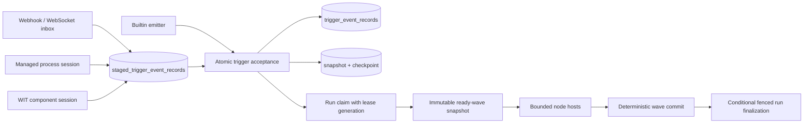
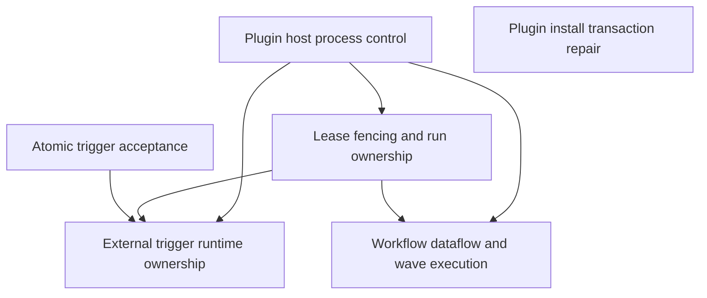
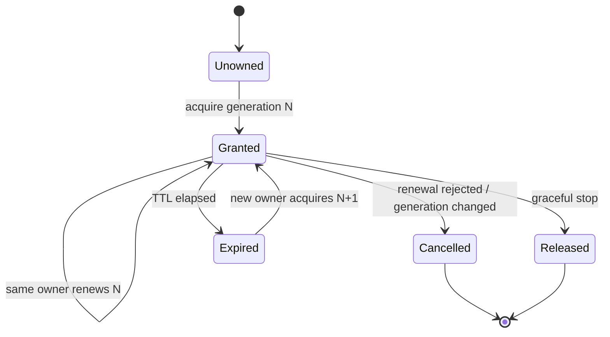

# AI Development Task Specification: ChainBot Plugin and Scheduler Hardening

## 1. Core Intent

> **[Human Input]** 修复 ChainBot 插件运行时与调度控制面的高风险架构缺口，使系统在慢插件、恶意输出、daemon lease 接管、进程 listener、Wasm guest、崩溃恢复和并行 DAG 执行下仍具备确定、可恢复、可验证的行为。

**Business Objectives**:

- 防止任一插件无限占用进程、内存、输出管道或 daemon 执行线程。
- 把 serve lease 从单纯互斥升级为可取消、可 fencing 的执行所有权。
- 确保 trigger event、snapshot、checkpoint 和 staged 状态原子提交。
- 让长期 process trigger 由 supervisor 真正拥有，而非阻塞在一次 daemon poll 调用中。
- 让 WIT Component Model 成为 Wasm trigger 的唯一长期 ABI 权威。
- 修复插件替换失败时旧版本无法恢复的问题。
- 让 workflow 数据依赖可由 DAG 验证，并在此基础上实现真正的 bounded wave concurrency。

**Success Criteria**:

- 普通 subprocess、MCP、process trigger 和 Wasm guest 都有 typed timeout、cancellation、output/resource limit 和 cleanup 行为。
- lease 被接管后，旧 daemon 无法提交新的 run 终态，且其 host 子进程在 grace period 内退出或被杀死。
- 任意 acceptance SQL 步骤失败后，不出现 event/checkpoint/snapshot/staged 部分提交。
- 长期 listener 的 child handle、stdin、reader task、bounded channel 和 restart 状态全部归 `ExternalTriggerSupervisor` 所有。
- Release N 接受 `node.<node_id>.<output_key>`，旧 flat node output 引用产生定位明确的兼容告警；Release N+1 可直接移除兼容分支。
- 同 wave 节点只能读取 wave 开始时的 immutable namespace snapshot，输出按 node ID 确定性提交。
- 独立 ready 节点真实重叠执行，同时保持现有 `depends_mode`, `when`, skip/failure 和 subflow 语义。
- SQLite 与 PostgreSQL 对 lease generation、run fencing 和 atomic trigger acceptance 保持行为一致。

## 2. Context & Boundaries

### 2.1 Primary Impact Scope

- **Codebase**: ChainBot Cargo workspace and repository-local official plugins.
- **Core Modules**:
  - `crates/chainbot/src/plugin/` - plugin manifest, node host and shared process controls.
  - `crates/chainbot/src/app/runtime/` - workflow execution, daemon lifecycle and external-trigger supervision.
  - `crates/chainbot/src/domain/workflow/` - node output reference and DAG validation contracts.
  - `crates/chainbot/src/domain/trigger/` - trigger acceptance command/outcome semantics.
  - `crates/chainbot/src/domain/state/` - lease grant, execution fence and persisted state models.
  - `crates/chainbot/src/infrastructure/state/` - SQLite/PostgreSQL transactions, migration and fencing enforcement.
  - `crates/chainbot/wit/` - authoritative Wasm trigger Component Model contract.
  - `official-plugins/*-trigger/` - lifecycle declarations aligned with actual listener behavior.
  - `examples/` and `interface/user-docs/` - compatibility examples and migration guidance.

### 2.2 Prohibited Modification Scope

- `official-plugins/*-node/crate/src/**` - do not move chain/provider/signing logic into the core runtime.
- Plugin business schemas and chain event payload semantics - host work remains transport/control-plane only.
- `node.exec.v2` JSON-RPC method name `node.execute` - frozen by the plugin host protocol decision.
- MCP per-invocation session policy - not changed by this task.
- `depends_mode = "any"` terminal-state behavior - remains non-short-circuit.
- External brokers, distributed queues or a new orchestration service - not required for the current single-root control plane.
- `fmt`, `cargo fmt` and `rustfmt` - prohibited by repository policy.
- Unrelated CLI redesign, root layout migration or plugin source catalog changes.

### 2.3 Required Decision Truth

- `decision-chainbot-workflow-dag-design`: producer-addressed node outputs, one-release flat compatibility, immutable wave snapshots and deterministic commit.
- `decision-chainbot-plugin-host-protocol-design`: bounded host resources, dual process-trigger lifecycles and WIT Component Model authority.
- `decision-chainbot-plugin-source-install`: prepare/stage/swap/revalidate/rollback remains the install contract.

## 3. Visual Logic Models

### 3.1 Target Runtime Flow



**Invariant**: durable staging precedes plugin ACK; atomic acceptance precedes run execution; a matching lease generation is required to finalize daemon-owned work.

### 3.2 Delivery Dependency Graph



- Task Groups 3 and 5 can execute independently after the decision updates.
- Task Group 4 must consume cancellation/fencing from Groups 1-2 and atomic staging/acceptance from Group 3.
- Task Group 6 must not enable parallel execution before Groups 1-2 provide bounded, cancellable node hosts.

### 3.3 Lease and Run Ownership State



A run started under generation N may only update its terminal state while generation N remains current. Renewal does not increment the generation; takeover does.

## 4. Interface & Data Definitions

### 4.1 Plugin Process Control

Create a crate-private process control module under `crates/chainbot/src/plugin/` only after confirming the same implementation is used by node subprocess and process-trigger hosts.

```rust
pub(crate) struct PluginProcessLimits {
    pub wall_timeout: Duration,
    pub shutdown_grace: Duration,
    pub max_stdout_bytes: usize,
    pub max_stderr_bytes: usize,
    pub max_frame_bytes: usize,
}

pub(crate) struct HostCancellation {
    // Cloneable atomic cancellation state; no new dependency required.
}

pub(crate) enum PluginProcessFailure {
    TimedOut,
    Cancelled,
    StdoutLimitExceeded,
    StderrLimitExceeded,
    FrameLimitExceeded,
    Spawn(std::io::Error),
    Io(std::io::Error),
    Exit { code: Option<i32>, stderr: String },
}
```

Required default limits for Release N:

| Adapter | Wall time | stdout | stderr | Frame | Shutdown grace |
|---|---:|---:|---:|---:|---:|
| `node.exec.v1/v2` | 30 s | 1 MiB | 256 KiB | N/A | 3 s |
| MCP stdio/HTTP | preserve current 10 s request timeout | normalized output <= 1 MiB | 256 KiB | N/A | 3 s |
| `process_short_lived` trigger | 60 s | streamed | 256 KiB | 64 KiB | 3 s |
| `process_daemon_session` trigger | no total wall deadline | streamed | 256 KiB ring buffer | 64 KiB | 10 s |

Production root config is intentionally not expanded in this task. Constructors expose crate-private limit overrides for deterministic tests. Add operator configuration only after measured workloads show defaults are insufficient.

### 4.2 Lease Grant and Run Fence

```rust
pub struct ServeLeaseGrant {
    pub owner_id: String,
    pub generation: u64,
    pub expires_at_ms: i64,
}

pub struct RunExecutionFence {
    pub owner_id: String,
    pub lease_generation: u64,
}
```

`LeaseAcquireResult` returns the current grant for `Acquired` and `Renewed`. A new owner increments generation; a same-owner renewal preserves it.

Runtime schema migration v6 adds:

```text
serve_leases.generation       BIGINT NOT NULL DEFAULT 0
run_summaries.owner_id        TEXT NULL
run_summaries.lease_generation BIGINT NULL
```

Manual `chainbot run` records keep both fence columns `NULL`. Daemon-triggered runs require both values.

### 4.3 Atomic Trigger Acceptance

Replace the shallow multi-write acceptance interface with a command/outcome seam:

```rust
pub struct TriggerAcceptanceCommand {
    pub candidate_record: TriggerEventRecord,
    pub expected_snapshot_sequence: u64,
    pub staged_id: Option<String>,
}

pub enum TriggerAcceptanceOutcome {
    Accepted {
        request: TriggerRunRequest,
        record_ref: String,
    },
    Duplicate,
    DedupSuppressed,
    CooldownSuppressed,
    Conflict,
}
```

A single backend transaction must perform the applicable operations:

1. Re-check duplicate/dedup/cooldown readiness.
2. Insert the trigger event.
3. Upsert the derived snapshot.
4. Upsert checkpoint when present.
5. Mark the staged record accepted when present.
6. Commit and only then return `Accepted`.

On duplicate `(trigger_id, event_id)`, the transaction reads the existing event, repairs checkpoint from that durable record when needed, marks the matching staged row accepted and returns `Duplicate`. Opaque checkpoint strings are never ordered or compared lexically.

### 4.4 Trigger Runtime Lifecycle and Wasm ABI

Add one lifecycle variant:

```rust
pub enum TriggerRuntimeLifecycle {
    ProcessShortLived,
    ProcessDaemonSession,
    WasmDaemonPersistentSession,
}
```

Add an explicit Wasm ABI selector:

```rust
pub enum WasmTriggerAbi {
    ComponentV1,
    CoreV0,
}
```

- `abi = "component_v1"` is required for new Wasm trigger manifests.
- Missing `abi` maps to `core_v0` only during Release N and emits a compatibility warning.
- `core_v0` routes through a private legacy adapter and is removed in Release N+1.
- `crates/chainbot/wit/trigger-plugin.wit` is the only editable WIT source. Remove the root duplicate after references are migrated.

### 4.5 Producer-Addressed Runtime Variables

Supported Release N wire forms:

```toml
source = "node.read-balance.balance"
```

```toml
[nodes.inputs.source]
namespace = "node_outputs"
producer = "read-balance"
key = "balance"
```

Legacy compatibility form:

```toml
source = "node.balance"
```

Internal node outputs become producer-scoped:

```rust
BTreeMap<NodeId, BTreeMap<OutputKey, serde_json::Value>>
```

Validation requirements:

- Producer node exists.
- Producer is in the consumer's transitive dependency closure.
- A node cannot reference its own output.
- `when`, normal inputs and subflow imports use the same validation path.
- Legacy flat lookup fails with `AmbiguousLegacyNodeOutput` if more than one completed producer exposes the key; last-writer-wins is removed immediately.
- Ordinary plugin outputs populate producer-scoped `node_outputs`; they are not duplicated into `run_scoped`.

## 5. Task Decomposition & Implementation Directives

### Task Group 1: Plugin Host Process Control

**Purpose**: Establish one bounded, cancellable process execution primitive before changing daemon ownership or scheduler concurrency.

**Related Files**: `crates/chainbot/src/plugin/host.rs`, `crates/chainbot/src/plugin/mod.rs`, new `crates/chainbot/src/plugin/process.rs`, `crates/chainbot/src/plugin/AGENTS.md`, `crates/chainbot/src/script_protocol.rs`, `crates/chainbot/src/plugin/source/prepare.rs`, `crates/chainbot/src/errors.rs`, `crates/chainbot/tests/node_plugin_host.rs`, `crates/chainbot/tests/mcp_plugin_host.rs`.

**Requirements**: Use standard library process groups, bounded readers and atomic cancellation. Reuse existing worker/source-build behavior rather than maintaining three different timeout implementations.

- **[ ] 1.1: Shared bounded process guard**
  - **Input**: Existing node subprocess, WorkerHost and source build timeout implementations.
  - **Instructions**:
    1. Extract only the process-group setup, deadline polling, cancellation polling, bounded stream collection and graceful/forced termination behavior shared by at least two callers.
    2. Keep the module crate-private; do not expose a public generic process framework.
    3. Poll cancellation/deadline at a bounded interval no greater than 50 ms.
    4. On Unix, terminate the full process group. On non-Unix, kill the direct child and preserve existing fallback behavior.
    5. Preserve the environment allowlist and never reintroduce inherited secret-bearing environment variables.
  - **Objective**: All plugin child processes use one cleanup contract.
  - **Acceptance Criteria**:
    - [ ] A child plus spawned grandchild is terminated on timeout in a Unix integration test.
    - [ ] stdout/stderr collection stops at configured byte limits and returns typed failures.
    - [ ] Cancellation terminates the child before the wall timeout.
    - [ ] `script_protocol.rs` and `plugin/source/prepare.rs` either reuse the shared primitive or retain a documented reason why their behavior differs.

- **[ ] 1.2: Bounded external node execution**
  - **Input**: `ExternalNodePluginHost::execute_subprocess` and MCP adapters.
  - **Instructions**:
    1. Add default limits and crate-private test constructors to `ExternalNodePluginHost`.
    2. Replace unbounded `wait_with_output()` with the shared process guard.
    3. Enforce output limits before JSON decoding.
    4. Preserve JSON-RPC request ID, method and schema validation.
    5. Ensure cancellation and timeout errors pass through activation-secret redaction.
    6. Preserve MCP per-invocation lifecycle while normalizing its timeout/output errors into the same host failure categories.
  - **Objective**: No node plugin can hold a workflow indefinitely or allocate unbounded output memory.
  - **Acceptance Criteria**:
    - [ ] A sleeping `node.exec.v2` fixture returns timeout and leaves no child process.
    - [ ] Oversized stdout and stderr fixtures fail with distinct typed errors.
    - [ ] Existing `node.exec.v1`, `node.exec.v2` and MCP contract tests remain green.
    - [ ] Error strings and persisted logs contain no activation plaintext.

- **[ ] 1.3: Host failure contract consolidation**
  - **Input**: Existing `ContractError` plugin process/MCP variants.
  - **Instructions**:
    1. Add or consolidate typed categories for timeout, cancellation, resource limit, protocol violation and plugin-reported failure.
    2. Keep user-facing error codes stable where an equivalent code already exists.
    3. Avoid parsing error-message text to classify failures.
  - **Objective**: Callers can react to lease cancellation and resource failures without string matching.
  - **Acceptance Criteria**:
    - [ ] Unit tests exhaustively match every new failure category.
    - [ ] Existing CLI error rendering tests continue to pass.

### Task Group 2: Daemon Lease Fencing and Run Ownership

**Purpose**: Prevent stale daemon work from committing after lease expiry or takeover, while keeping lease renewal independent of workflow latency.

**Related Files**: `crates/chainbot/src/app/runtime/daemon.rs`, `crates/chainbot/src/app/cli/commands.rs`, `crates/chainbot/src/domain/state/lease.rs`, `crates/chainbot/src/domain/state/model.rs`, `crates/chainbot/src/domain/state/records.rs`, `crates/chainbot/src/infrastructure/state/db_store.rs`, `crates/chainbot/src/infrastructure/state/sqlite_coordination.rs`, `crates/chainbot/tests/runtime_state_parity.rs`, `crates/chainbot/tests/end_to_end_vertical_slice.rs`, `crates/chainbot/tests/state_runtime_persistence.rs`.

**Requirements**: Use additive schema migration v6, an independent heartbeat worker, an atomic cancellation signal and conditional fenced writes. Do not introduce a queue service.

- **[ ] 2.1: Generation-bearing lease migration**
  - **Input**: Existing lease schema and `try_acquire_serve_lease` transactions.
  - **Instructions**:
    1. Add migration v6 for SQLite and PostgreSQL.
    2. Backfill existing lease generation as `0`; first post-migration takeover becomes generation `1`.
    3. Increment generation only when ownership changes after release/expiry; same-owner renewal retains generation.
    4. Return `ServeLeaseGrant` from acquire/renew paths.
    5. Keep acquisition atomic under concurrent contenders on both backends.
  - **Objective**: Every daemon ownership term has a monotonic fencing identity.
  - **Acceptance Criteria**:
    - [ ] Same-owner renewal preserves generation.
    - [ ] Expired-owner takeover increments generation exactly once.
    - [ ] Concurrent contenders produce one grant winner.
    - [ ] Migration is idempotent on an existing v5 database.
    - [ ] SQLite/PostgreSQL parity tests assert the same generation transitions.

- **[ ] 2.2: Independent lease heartbeat and cancellation**
  - **Input**: Current `ServeLeaseSupervisor::maybe_renew` and Task Group 1 cancellation primitive.
  - **Instructions**:
    1. Start a dedicated heartbeat worker after daemon acquisition and stop/join it during teardown.
    2. Open a fresh state-store connection per heartbeat worker; do not share `rusqlite::Connection` across threads.
    3. Renew at the existing 10-second interval and publish cancellation immediately on rejection or persistent storage failure.
    4. Pass cancellation into workflow execution, node hosts, process trigger supervisor and Wasm sessions.
    5. Keep explicit `maybe_renew` calls only where they provide a useful synchronous fence check; they must not remain the sole renewal mechanism.
  - **Objective**: Slow workflows do not expire a healthy lease, and lease loss reaches every active host.
  - **Acceptance Criteria**:
    - [ ] A workflow running longer than 30 seconds retains its lease while the heartbeat worker is healthy.
    - [ ] Forced lease takeover sets cancellation and terminates active plugin children.
    - [ ] Daemon stop joins heartbeat and host cleanup without detached threads.
    - [ ] No heartbeat thread writes after daemon teardown completes.

- **[ ] 2.3: Fenced run start, recovery and finalization**
  - **Input**: `execute_single_run`, run summary persistence and restart recovery.
  - **Instructions**:
    1. Persist owner/generation on daemon-owned `Running` summaries; manual runs keep null fence columns.
    2. Make terminal updates conditional on matching owner/generation and current lease ownership.
    3. Return a typed lease-lost outcome when a conditional update affects zero rows.
    4. Move generic incomplete-run recovery out of unconditional runtime-context loading.
    5. Recover only runs whose owner generation is no longer current or whose lease term is definitively expired.
    6. Never let a new daemon mark a still-current generation's run failed.
  - **Objective**: A stale daemon cannot overwrite a successor's state, and recovery does not corrupt active runs.
  - **Acceptance Criteria**:
    - [ ] A forced takeover test proves generation N cannot write success after N+1 is granted.
    - [ ] Recovery marks only stale fenced runs failed.
    - [ ] Manual run recovery semantics remain unchanged.
    - [ ] A stale daemon's external node process is cancelled before finalization.
    - [ ] Trigger replay does not duplicate a run that has an active valid claim.

### Task Group 3: Atomic Trigger Acceptance

**Purpose**: Move trigger acceptance persistence behind one deep transactional interface and close checkpoint/snapshot crash windows.

**Related Files**: `crates/chainbot/src/domain/trigger/acceptance.rs`, `crates/chainbot/src/domain/state/model.rs`, `crates/chainbot/src/domain/state/records.rs`, `crates/chainbot/src/infrastructure/state/mod.rs`, `crates/chainbot/src/infrastructure/state/db_store.rs`, `crates/chainbot/tests/trigger_plane.rs`, `crates/chainbot/tests/runtime_state_parity.rs`, `crates/chainbot/tests/state_runtime_persistence.rs`.

**Requirements**: Domain code prepares and interprets acceptance commands; backend adapters own transaction boundaries. Every persisted projection updates atomically.

- **[ ] 3.1: Deep acceptance command/outcome interface**
  - **Input**: Current `TriggerStateStore` methods and `normalize_emission` flow.
  - **Instructions**:
    1. Replace fine-grained write calls with `accept_trigger_event(command)` plus the minimum read/stage methods still needed by process/Wasm ingress.
    2. Keep payload mapping, event validation and run-request construction in the trigger domain.
    3. Put duplicate/dedup/cooldown re-check and all persistence mutations inside the backend transaction.
    4. Use expected snapshot sequence to detect stale in-memory acceptance state.
    5. Return typed outcomes instead of treating every suppression as `None`.
  - **Objective**: The interface expresses one domain operation rather than exposing table update order.
  - **Acceptance Criteria**:
    - [ ] The production adapter implements one acceptance commit method for both backends.
    - [ ] `TriggerPlane` no longer sequences record/snapshot/checkpoint/staged writes itself.
    - [ ] Existing dedup, cooldown, disabled-trigger and replay semantics remain unchanged.

- **[ ] 3.2: SQLite/PostgreSQL atomic commit**
  - **Input**: `TriggerAcceptanceCommand` and existing runtime tables.
  - **Instructions**:
    1. Execute duplicate checks, event insert, snapshot/checkpoint upsert and staged acceptance in one transaction.
    2. On duplicate event, repair checkpoint from the existing durable event and consume the duplicate staged row.
    3. Roll back the entire transaction on any serialization, SQL or optimistic-sequence conflict.
    4. Preserve append-only trigger event history and existing unique keys.
  - **Objective**: No crash point leaves checkpoint behind its accepted event.
  - **Acceptance Criteria**:
    - [ ] Test-only failpoints after each SQL mutation prove full rollback.
    - [ ] Replaying a duplicate staged event repairs a deliberately missing checkpoint.
    - [ ] A failed checkpoint write leaves no event, snapshot or staged mutation committed.
    - [ ] Both storage backends pass the same acceptance matrix.

- **[ ] 3.3: Replay and retention compatibility**
  - **Input**: Existing replay query, history retention and archived event behavior.
  - **Instructions**:
    1. Keep replay keyed by durable accepted event plus absent run summary/claim.
    2. Ensure retention cannot archive an event still required to repair/replay a run.
    3. Preserve trigger snapshot startup repair for pre-migration databases.
  - **Objective**: Atomic acceptance does not regress restart or archive behavior.
  - **Acceptance Criteria**:
    - [ ] Restart between acceptance commit and run start replays exactly once.
    - [ ] Restart after run claim does not enqueue a duplicate.
    - [ ] Retention tests cover accepted-but-not-run records.

### Task Group 4: External Trigger Runtime Ownership and Wasm ABI

**Purpose**: Give process and Wasm listeners explicit lifecycle ownership, bounded communication and cancellation semantics.

**Related Files**: `crates/chainbot/src/plugin/contract.rs`, `crates/chainbot/src/app/runtime/external_triggers/process_listener.rs`, `crates/chainbot/src/app/runtime/external_triggers/supervisor.rs`, `crates/chainbot/src/app/runtime/external_triggers/wasmtime.rs`, `crates/chainbot/src/app/runtime/daemon.rs`, `crates/chainbot/wit/trigger-plugin.wit`, `wit/trigger-plugin.wit`, `crates/chainbot/Cargo.toml`, `crates/chainbot/tests/trigger_plane.rs`, `crates/chainbot/tests/chain_trigger_runtime.rs`, `crates/chainbot/tests/end_to_end_vertical_slice.rs`, `official-plugins/*-trigger/config.toml`, `examples/plugin-integrations/`.

**Requirements**: Preserve `trigger.exec.v1` wire frames. Add explicit lifecycle and ABI selectors, bounded channels, supervisor-owned resources and graceful escalation.

- **[ ] 4.1: Dual process lifecycle contract**
  - **Input**: Current `ProcessShortLived` manifests and confirmed lifecycle decision.
  - **Instructions**:
    1. Add `ProcessDaemonSession` and validate its required `inline_response` plus `after_store_persist` ACK semantics.
    2. Keep `ProcessShortLived` as a bounded turn with the 60-second default deadline and event/output budgets.
    3. Add catalog/help rendering for the new lifecycle without changing `trigger.exec.v1` frame names.
    4. Migrate `aster`, `binance`, `bitget`, `bybit`, `eth`, `gate`, `hyperliquid`, `okx` and `solana` official triggers to `process_daemon_session`.
    5. Keep `uniswap-trigger` on `process_short_lived`; its implementation is a bounded `max_polls` loop.
  - **Objective**: Manifest lifecycle names match actual runtime behavior.
  - **Acceptance Criteria**:
    - [ ] Root validation rejects daemon-session manifests with caller-scope ACK semantics.
    - [ ] Short-lived fixtures exceeding deadline or event budget terminate cleanly.
    - [ ] All ten official trigger manifests validate against their selected lifecycle.
    - [ ] Catalog output distinguishes bounded and managed process sessions.

- **[ ] 4.2: Supervisor-owned managed process session**
  - **Input**: Task Groups 1-3 primitives and existing listener protocol state machine.
  - **Instructions**:
    1. Move spawn/start/ready/heartbeat/event/ACK/stop ownership from `stream_emissions` into a `ProcessTriggerSession` held by `ExternalTriggerSupervisor`.
    2. Use bounded `sync_channel` queues for frames/events and a separate control path for ACK/stop.
    3. Reject frames larger than 64 KiB before JSON decoding; retain only a bounded stderr tail.
    4. Have the daemon drain staged events per cycle without waiting for child exit.
    5. ACK only after durable staging succeeds.
    6. Reconcile manifest/lifecycle changes by sending stop, waiting shutdown grace, killing the process group if needed and joining reader threads.
    7. Propagate lease cancellation as terminal stop and prevent restart under stale ownership.
    8. Make `reconcile` fallible; startup failures must be typed errors, never panics.
  - **Objective**: The daemon loop remains responsive while listeners run continuously.
  - **Acceptance Criteria**:
    - [ ] Two long-lived trigger fixtures run concurrently and both deliver events.
    - [ ] A silent listener hits heartbeat timeout without blocking another listener.
    - [ ] `chainbot stop` terminates all child and reader threads within configured grace.
    - [ ] Config reload replaces only sessions whose effective spec changed.
    - [ ] Lease takeover prevents old sessions from staging or receiving ACK.
    - [ ] Channel saturation returns backpressure and remains bounded in memory.

- **[ ] 4.3: WIT Component Model host**
  - **Input**: `trigger-plugin.wit`, current core-Wasm adapter and Wasmtime 38.
  - **Instructions**:
    1. Keep `crates/chainbot/wit/trigger-plugin.wit` as the sole source and generate host/guest bindings with `wasmtime::component::bindgen!`.
    2. Remove `wit/trigger-plugin.wit` after all references use the crate-local source.
    3. Load `component_v1` with `wasmtime::component::Component`; do not route it through core `Module`.
    4. Convert compile, instantiate, missing export and guest trap paths to typed `Result` failures.
    5. Enable store limits plus fuel or epoch interruption for every guest turn.
    6. Keep current core module logic in a private `core_v0` adapter selected explicitly or by Release N compatibility default.
    7. Emit a validation warning for absent/legacy ABI and migrate the Wasm example to `component_v1`.
  - **Objective**: Standard WIT-generated guests interoperate with the host and cannot run without CPU bounds.
  - **Acceptance Criteria**:
    - [ ] A component fixture generated from WIT invokes `push-trigger-event` and receives every typed result variant.
    - [ ] Infinite-loop guest execution is interrupted within the configured turn budget.
    - [ ] Invalid component bytes return an error without unwinding the daemon.
    - [ ] Core-v0 fixture remains supported with a compatibility warning in Release N.
    - [ ] No production code compares duplicate WIT files as text.

- **[ ] 4.4: Trigger host recovery matrix**
  - **Input**: Managed process and component implementations.
  - **Instructions**:
    1. Cover start failure, pre-ready event, duplicate ready, heartbeat timeout, plugin fatal, staging backpressure, lease loss, shutdown and restart.
    2. Assert process and Wasm adapters map equivalent conditions to the same typed host categories.
    3. Keep raw payload/secret material out of errors and persisted daemon diagnostics.
  - **Objective**: Host behavior is equivalent across transport adapters where semantics overlap.
  - **Acceptance Criteria**:
    - [ ] The complete matrix runs against SQLite.
    - [ ] Durable staging and lease-loss rows run against PostgreSQL in CI.
    - [ ] No test relies solely on elapsed wall-clock timing when a barrier/channel assertion is possible.

### Task Group 5: Plugin Install Transaction Repair

**Purpose**: Ensure every destructive replacement step has a live rollback owner before it executes.

**Related Files**: `crates/chainbot/src/plugin/source/install.rs`, `crates/chainbot/src/plugin/source/fs.rs`, `crates/chainbot/src/app/cli/commands.rs`, `crates/chainbot/tests/plugin_install_surface.rs`.

**Requirements**: Keep prepare/stage/swap/revalidate/finalize behavior and `--force` semantics unchanged. Fix promotion-failure rollback with the smallest stateful transaction guard.

- **[ ] 5.1: Rollback-safe promotion state machine**
  - **Input**: Existing `InstallTransaction::begin/finalize/rollback` flow.
  - **Instructions**:
    1. Construct the transaction guard before moving the existing target to backup.
    2. Track explicit states: staged, backup moved, promoted, finalized/rolled back.
    3. On promotion error, remove any partial target and restore backup before returning.
    4. Keep explicit rollback errors observable; `Drop` is emergency best-effort cleanup only.
    5. Clean staging parent directories after finalize/rollback without deleting unrelated transaction data.
  - **Objective**: Failure cannot leave an installed plugin available only under an internal backup path.
  - **Acceptance Criteria**:
    - [ ] A test-only promotion hook creates a target conflict after backup move and proves the old plugin is restored.
    - [ ] Fresh install failure leaves no target or backup artifact.
    - [ ] `--force` success still removes backup only after root revalidation.
    - [ ] Root validation failure restores the byte-identical previous plugin package.

- **[ ] 5.2: Interrupted transaction recovery**
  - **Input**: Existing `.chainbot/plugin-transactions` directory.
  - **Instructions**:
    1. Add deterministic startup/install-time reconciliation only for transaction directories created by the current schema.
    2. Restore backup when target is absent; remove stale backup only when a validated target is present.
    3. Do not infer ownership from arbitrary directory names; persist minimal transaction metadata before destructive moves.
  - **Objective**: Process termination between filesystem renames is recoverable on the next install/validate operation.
  - **Acceptance Criteria**:
    - [ ] Fixtures cover interruption before backup, after backup and after promotion.
    - [ ] Recovery is idempotent.
    - [ ] Malformed transaction metadata fails closed without deleting package data.

### Task Group 6: Workflow Dataflow Contract and Wave Execution

**Purpose**: Eliminate implicit shared-output ordering and enable bounded parallel execution only after data dependencies become explicit.

**Related Files**: `crates/chainbot/src/domain/workflow/variables.rs`, `crates/chainbot/src/domain/workflow/contract.rs`, `crates/chainbot/src/domain/workflow/subflow.rs`, `crates/chainbot/src/domain/workflow/when.rs`, `crates/chainbot/src/domain/runtime/contract.rs`, `crates/chainbot/src/app/runtime/execution.rs`, `crates/chainbot/src/app/definitions/validate.rs`, `crates/chainbot/src/errors.rs`, `crates/chainbot/tests/workflow_dag_semantics.rs`, `crates/chainbot/tests/execution_scheduler.rs`, `examples/**/workflows/**/config.toml`, `interface/user-docs/`.

**Requirements**: Implement producer-addressed references and one-release warning compatibility before real concurrency. Preserve deterministic reports and current dependency terminal-state semantics.

- **[ ] 6.1: Versioned producer-addressed references**
  - **Input**: Current two-segment shorthand parser and structured `VariableReference`.
  - **Instructions**:
    1. Parse `node.<node_id>.<output_key>` and structured `{ namespace, producer, key }` forms.
    2. Continue parsing `node.<output_key>` as legacy during Release N.
    3. Add a validation-warning read model that includes workflow ID, consumer node ID, original reference and replacement guidance.
    4. Surface warnings from `chainbot validate` and structured JSON output without converting successful validation into failure.
    5. Update repository examples and user docs to producer-addressed references immediately.
    6. Keep non-node namespace shorthand unchanged.
  - **Objective**: New workflows have unambiguous output ownership while old roots remain runnable for one release.
  - **Acceptance Criteria**:
    - [ ] New shorthand and structured forms round-trip through serde.
    - [ ] Legacy references produce exactly one stable warning per source location.
    - [ ] Unknown producer, self-reference and malformed three-segment references fail validation.
    - [ ] Existing non-node variable reference tests remain unchanged.

- **[ ] 6.2: Data dependency validation and scoped namespaces**
  - **Input**: Validated workflow graph and producer-addressed references.
  - **Instructions**:
    1. Build the transitive dependency closure once during workflow validation.
    2. Validate every node-output reference used by inputs, `when` and subflow imports against that closure.
    3. Change runtime node outputs to producer-scoped storage.
    4. Stop duplicating normal plugin outputs into `run_scoped`.
    5. Resolve legacy flat keys only from completed prior waves; return `AmbiguousLegacyNodeOutput` on collision.
  - **Objective**: Runtime visibility follows declared DAG edges rather than BTree execution order.
  - **Acceptance Criteria**:
    - [ ] A same-wave sibling reference is rejected even if lexical node order previously made it work.
    - [ ] Renaming an unrelated node cannot change input resolution.
    - [ ] Two producers may emit the same output key without collision for addressed consumers.
    - [ ] Legacy ambiguous lookup fails deterministically instead of selecting a last writer.

- **[ ] 6.3: Immutable two-pass ready waves**
  - **Input**: Scoped namespaces and current dependency evaluator.
  - **Instructions**:
    1. At wave start, clone one immutable namespace snapshot.
    2. Evaluate all `when` gates and resolve all node inputs from that snapshot.
    3. Execute nodes into isolated `NodeExecutionOutcome` values without mutating shared namespaces.
    4. Sort outcomes by node ID and commit state/output/failure changes only after the entire wave completes.
    5. Clone subflow active stacks per node execution path; keep recursion depth and cycle checks unchanged.
  - **Objective**: Sequential and parallel wave execution have identical deterministic semantics.
  - **Acceptance Criteria**:
    - [ ] Same-wave outputs are never visible to sibling inputs or `when` conditions.
    - [ ] Failure/skip behavior matches existing scheduler tests.
    - [ ] Report ordering and `schedule_waves` remain deterministic across repeated runs.

- **[ ] 6.4: Bounded ready-wave concurrency**
  - **Input**: Task Groups 1-2 cancellation/fencing and immutable wave execution.
  - **Instructions**:
    1. Make registry handlers and execution dependencies `Send + Sync` only where required by actual parallel dispatch.
    2. Use scoped standard-library workers with an internal default maximum of four concurrent nodes; do not add a new executor dependency or root config in Release N.
    3. Stop scheduling new work on cancellation while joining already-started workers and propagating cancellation to hosts.
    4. Commit outcomes deterministically regardless of completion order.
    5. Preserve author-controlled serialization through `depends_on`.
  - **Objective**: Independent ready nodes overlap without introducing shared-state races.
  - **Acceptance Criteria**:
    - [ ] A barrier-based test proves at least two ready handlers execute concurrently.
    - [ ] More than four ready handlers never exceed the configured test concurrency cap.
    - [ ] Completion-order inversion does not change final namespaces or reports.
    - [ ] Lease cancellation prevents the next wave from starting.
    - [ ] Node/plugin timeout and cancellation tests remain green under concurrent scheduling.

## 6. Compatibility and Rollout

### Release N

- Add schema migration v6; all database changes are additive.
- Accept both producer-addressed and legacy flat node-output references.
- Emit validation warnings for every legacy flat reference.
- Support both `process_short_lived` and `process_daemon_session`.
- Support `component_v1` and legacy `core_v0` Wasm ABI.
- Migrate repository examples and official plugins to the new contracts.
- Record counters/read-model fields for legacy node refs and core ABI usage if existing observability surfaces can expose them without a new subsystem.

### Release N+1 Removal Gate

Do not remove compatibility based only on elapsed time. Removal requires:

- No repository examples or official packages use legacy flat node references.
- Compatibility warning behavior has shipped for at least one release.
- No official/plugin integration fixture uses absent ABI or `core_v0`.
- User docs contain migration examples.
- Removal is reflected in the relevant decision skills and version contract.

Then remove:

- `node.<output_key>` flat parsing and lookup.
- `WasmTriggerAbi::CoreV0` adapter and absent-ABI default.
- Compatibility warning variants that no longer have producers.

`process_short_lived` is not scheduled for removal; it remains valid for bounded pollers.

## 7. Implementation Constraints & Guidelines

- **Technology Stack**: Rust 2024, standard library process/thread primitives, Tokio where already present, Wasmtime 38 Component Model, rusqlite and postgres.
- **Dependency Rule**: Add no process-supervisor, queue or cancellation dependency. Enable an existing Wasmtime feature only if Component Model bindings require it.
- **Module Depth**: Prefer deep operations (`run_bounded_process`, `accept_trigger_event`, supervisor reconcile/drain) over exposing filesystem/SQL/process steps to callers.
- **Persistence**: Every new state guarantee must have SQLite and PostgreSQL implementations and parity tests.
- **Cancellation**: Cancellation is explicit data, not inferred from timeout text or child exit strings.
- **Error Handling**: Host compile/spawn/timeout/limit/lease-loss failures return typed errors. No production `panic!`, `unwrap()` or `expect()` at plugin trust boundaries.
- **Secret Safety**: Apply redaction after collecting bounded stderr/protocol errors and before user-visible or persisted output.
- **Determinism**: Sort only at commit/report boundaries; never use lexical order as a hidden data dependency.
- **Testing**: Prefer barriers, bounded channels, failpoints and conditional SQL assertions over flaky sleeps. Real-time timeout tests use short test-only limits.
- **Formatting**: Do not run `fmt`, `cargo fmt` or `rustfmt`.
- **Documentation**: Update the nearest `AGENTS.md` only when a file/module is added or ownership changes. Update decisions before changing the frozen contract they govern.

## 8. Verification Gates

Run focused gates after each task group, then the full crate suite:

```text
cargo test -p chainbot --test node_plugin_host --test mcp_plugin_host
cargo test -p chainbot --test runtime_state_parity --test state_runtime_persistence --test end_to_end_vertical_slice
cargo test -p chainbot --test trigger_plane --test chain_trigger_runtime --test ingress_runtime
cargo test -p chainbot --test plugin_install_surface
cargo test -p chainbot --test workflow_dag_semantics --test execution_scheduler
cargo test -p chainbot
cargo clippy -p chainbot --all-targets -- -D warnings
```

PostgreSQL acceptance, lease and fencing cases must run in CI with the repository-supported PostgreSQL test environment. A local run without PostgreSQL is not sufficient to approve Groups 2-4.

Decision skill validation:

```text
python3 /Users/cyouguang/.agents/skills/skill-design-guidelines/scripts/validate_skill.py .agents/skills/decision-chainbot-workflow-dag-design
python3 /Users/cyouguang/.agents/skills/skill-design-guidelines/scripts/validate_skill.py .agents/skills/decision-chainbot-plugin-host-protocol-design
```

## 9. Risk Register and Stop Conditions

| Risk | Detection | Required response |
|---|---|---|
| Conditional fenced update cannot be implemented consistently on both backends | Parity test or affected-row mismatch | Stop Group 2; do not emulate fencing in application memory. |
| WIT-generated component requires a Wasmtime major upgrade | Compile/spike failure on current v38 | Stop Group 4.3 and report exact feature/API blocker; do not hand-roll a second ABI. |
| Official listener cannot honor stop/ACK without source changes | Managed-session integration failure | Update that plugin locally while preserving `trigger.exec.v1`; do not weaken host lifecycle. |
| Producer-addressed refs conflict with an undocumented stable user format | Fixture/user-doc evidence | Preserve it only through the Release N compatibility parser and document migration. |
| Parallel registry conversion requires unsafe shared mutation | `Send + Sync` compiler errors around mutable state | Keep affected handler serialized or move state behind an existing safe owner; do not add unsafe synchronization. |
| Plugin transaction rollback cannot report a Drop failure | Fault-injection test | Keep rollback explicit and make Drop best effort; never claim Drop guarantees durable recovery. |

## 10. Review Checklist

- [ ] **Decision Alignment**: Updated DAG and plugin-host decision skills match every contract in this spec.
- [ ] **Dataflow Correctness**: Node output producer validation and wave visibility are unambiguous.
- [ ] **Lease Correctness**: Generation, cancellation, recovery and conditional finalization form one coherent ownership model.
- [ ] **Durability**: Trigger acceptance has one backend transaction and duplicate repair behavior.
- [ ] **Lifecycle Ownership**: Long-lived child/Wasm resources are owned and joined by the supervisor.
- [ ] **Resource Safety**: Every host adapter has explicit time/output/memory/CPU/cancellation limits.
- [ ] **Compatibility**: Release N and N+1 gates are testable and do not silently change old workflows.
- [ ] **Backend Parity**: SQLite and PostgreSQL share the same acceptance/fencing matrix.
- [ ] **Install Safety**: Promotion and interruption tests prove backup restoration.
- [ ] **Scope Compliance**: No chain/provider business behavior moved into core runtime.
- [ ] **Verification**: Focused suites, full crate tests and clippy pass without running rustfmt.

## Implementation Progress Tracking

- **Task Groups**: 0/6 completed
- **Subtasks**: 0/19 completed
- **Persistent Contract Migrations**: 0/2 completed (`schema v6`, node-output compatibility)
- **Host Lifecycle Migrations**: 0/10 official trigger manifests verified
- **Compatibility Removals**: 0/2 eligible for Release N+1
- **Specification Status**: Pending human review
